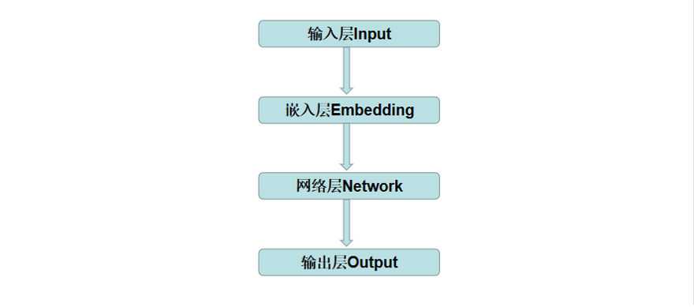
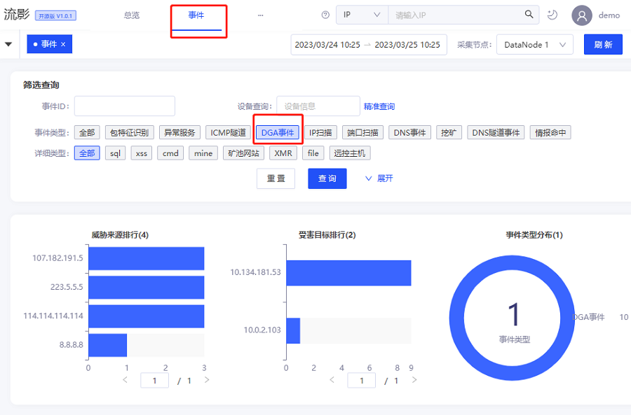
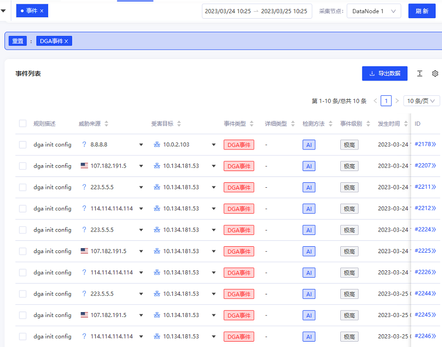
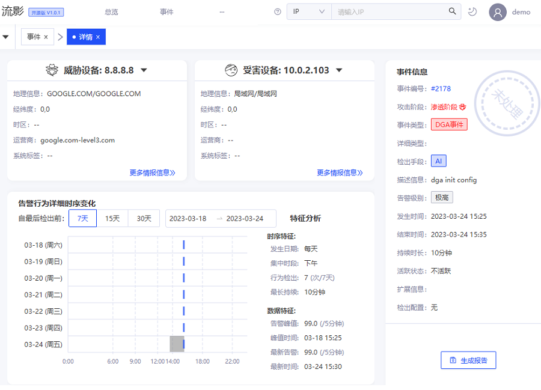
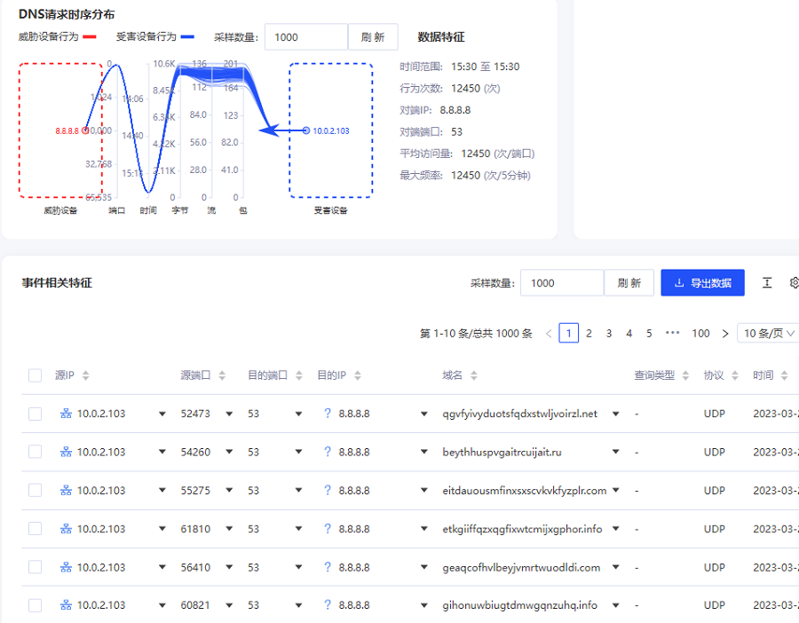

## 前言
DGA是域名生成算法(Domain Generation Algorithm)的简写，该技术被攻击者广泛应用于构建恶意软件基础设施之中，例如僵尸网络的C2（Command and Control）通讯设施， 如Mirai、Conficker、Mjuyh等僵尸网络, 通过生成域名的随机性与短时生存性来躲避检测。

识别DGA域名对安全防守方很有意义，能够协助发现恶意软件通讯行为，从而及时响应。流影内置了基于深度学习的DGA域名检测模型，支持从DNS流量中识别DGA域名，具有较高的准确度。本文简要介绍流影中如何查看和分析DGA告警事件。 

## DGA相关简介

2009年DGA被首次曝光，相关攻防技术目前已发展了十几年。DGA域名本身没有好坏之分，主要与使用者的目的有关。恶意攻击者利用DGA算法随机生成大量域名，来规避安全设备的检测封禁。其基本原理是，攻击者控制端和被控端运行相同的DGA算法，当需要发起攻击的时候，选择其中一部分进行注册生效，建立起C2通道后实施攻击。
截止目前，DGA仍然是广泛应用于恶意软件与C2服务器通信之中。业界、学界也对DGA算法进行了大量的研究，提出了许多检测方法。

1. 已知DGA域名碰撞检测
2. 基于概率统计的模型
3. 传统机器学习模型
4. 深度学习模型

开始时，DGA就是攻击者为了躲避传统域名碰撞检测而设计的域名生成算法，DGA域名数量巨大，黑名单很难覆盖DGA域名，需要阻断所有DGA域名才能中断C2，使得传统碰撞检测机制基本失效。

近年来大量的恶意软件中DGA算法被公开，积累了许多DGA域名数据，为构建深度学习模型提供了数据基础条件。深度学习技术具有强大的拟合和泛化能力，从一些研究结论和实际检测效果上来说，目前基于深度学习的模型准确率、误报率等综合性能方面都优于其他方法。
另一方面，并不能说深度学习已经完美解决了DGA域名检测的问题，事实上深度学习模型存在检测效率比较低的缺点，也无法杜绝误报。

## 流影中DGA域名检测技术
我们基于现有dga检测技术，进行了优化改造，模型定时离线训练，并在流影中集成了DGA域名检测AI模型。该检测模型基于千万级域名正、负样本数据，样本数据涵盖了主要流行DGA算法，使用LSTM深度学习模型训练而成，并进行了模型压缩和参数调优，兼顾了检测效率和性能。模型框架概要如下图所示。

该模型基于tensorflow开源框架训练而成，线上部署时需要tensorflow C++相关环境。

## 流影DGA告警查看与分析
流影中DGA告警事件是指系统对DNS流量中的域名检测，生成的疑似使用DGA域名通讯的网络行为事件告警。用户登录系统后，在主菜单点击“事件”，筛选查询区域，在事件类型可以筛选出DGA告警事件。页面上半部分主要显示统计相关信息，如下图所示：

在页面下方可以查看DGA告警事件列表，如图所示。

在事件列表中，点击某个事件ID后，跳转到该事件的详情页面，可以查看该告警详细信息，上方界面显示源、目的资产信息、事件信息、告警行为详细时序图及特征分析数据。

在详情页面下方区域，可视化展示了DNS请求时序特征图，以列表形式显示该事件相关特征信息。

从列表中可以看出，存在大量随机域名请求的通讯行为，需要引起警惕，表明主机可能存在恶意软件的，需要结合主机实际情况进一步分析确认。

## 相关防御建议
1. 及时修复高危漏洞
2. 避免运行来源不明的软件
3. 加强流量监测，识别DGA域名，排查相关主机

## 结语
流影基于神经网络深度学习技术，实现对DNS流量中DGA域名的实时监测和告警，并将可疑流量特征以可视化的方式呈现，能够帮助用户快速定性，有效缩短分析响应时间。

