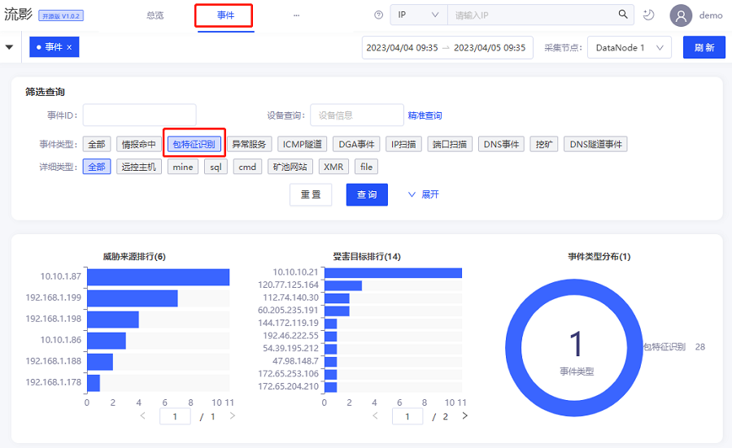
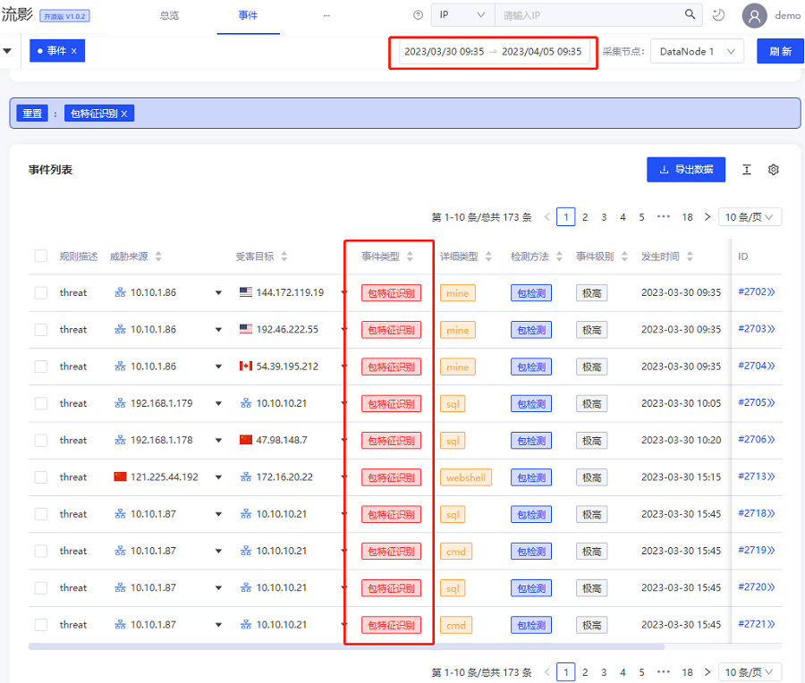
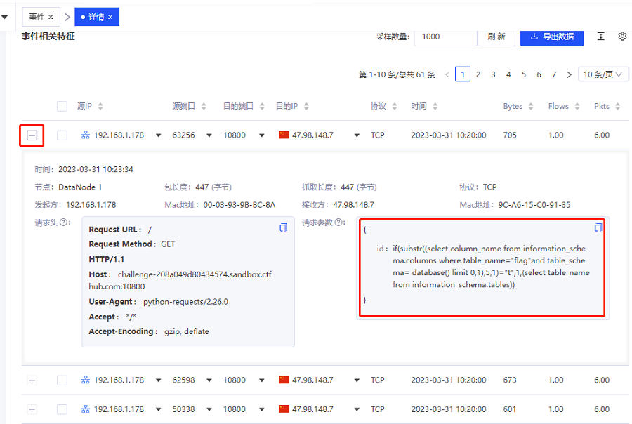
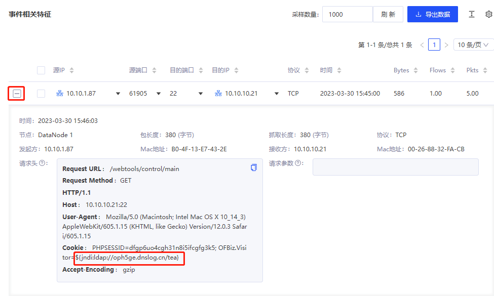
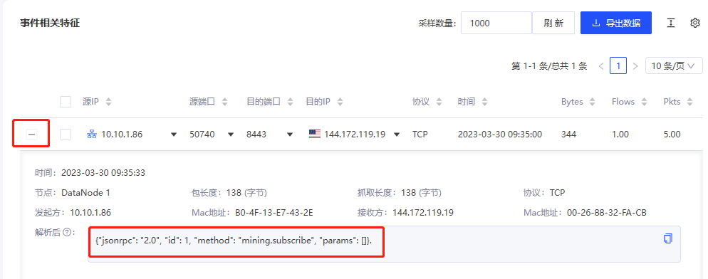
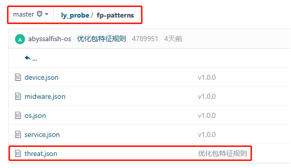
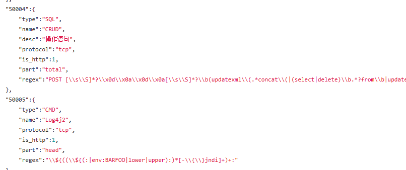

## 前言
流影已经开源4个月左右，几乎每周都有新的小伙伴入群，进行使用反馈和建议。大家的建议和需求，我们已经收集记录，列入后续改进迭代计划。这里首先对大家的踊跃参与表示感谢。

为了使大家了解流影的功能和应用场景，前期已经发布了几篇功能使用方面的blog，建议大家阅读。本文也是同系列文章，主要介绍流影中的包特征识别告警事件查看与分析使用。

## 深度包检测技术简介
传统IP数据包检测技术是对2层到4层之间的数据包（IP\TCP数据头）的检测分析，深度包检测DPI技术（Deep Packet Inspection）是相对于传统包检测技术而言，增加了对7层应用层数据包协议识别、内容检测与分析技术。DPI检测（包特征识别）技术本质上属于计算机科学基础中的模式匹配技术范畴。

DPI技术已经发展了大概30多年，其历史可以追溯到上世纪90年代。基本上随着计算机网络的形成，该技术相关雏形也伴随发展出现，最早被用于通过分析数据包来尝试解决UNIX相关安全问题。后来在网络流量分类中表现出色，DPI技术也被大家普遍认识。DPI技术应用广泛，包括不限于应用检测、网元分析、流量控制、入侵检测等方面。

DPI检测技术用于网络安全方面，除了检测算法之外，最重要的就是模式规则库，通俗的说就是指纹库，即正则表达式的逻辑组合数据库。网络攻击技术发展迅速，检测规则库也需要不断更新维护。规则库的质量，直接决定了一些使用该技术的安全产品的防护效果。

## 包检测事件查看与分析
流影利用深度包检测技术，实现疑似恶意网络行为识别和网络资产的被动测绘。开源版集成了部分恶意网络行为指纹，同时支持用户自定义指纹。使用深度包检测技术识别的事件，在流影中归类为包特征识别事件。对包识别特征事件，支持用户查看所匹配特征的Payload，并支持特征数据Pcap包的留存，便于取证分析。

开源流影已经集成的恶意网络行为包特征，主要包括SQL注入(sql)、命令执行(cmd)、代码执行(code)、XSS、系统文件(file)、后门(backdoor)、WebShell等类型。

用户登录系统后，在主菜单点击“事件”，进入事件总览页面，在筛选查询区域，通过事件类型可以筛选出包特征识别的告警事件，如果系统识别了相关事件，详细类型会出现其细分标签类型。点击查询，页面上半部分显示统计分布相关信息，如下图所示：

在页面下半部分区域，是筛选出的包特征识别告警事件列表，默认显示一天内事件，右上角可以选取事件的时间范围，如图所示。

在筛选出的包特征事件列表中，点击该事件ID后，可跳转到该事件的详情页面，进一步查看该告警事件相关详细信息，详情页面上半部分显示源、目的资产信息、事件信息、告警行为详细时序图及特征分析数据。在详情页面下半部分区域，可视化展示了TCP主动握手时序图及数据特征，以列表形式显示该事件相关NetFlow特征信息。包检测事件支持查看Payload数据特征，便于用户分析确认。例如对demo演示环境中的一个SQL事件，点击左侧按钮展开，即可查看其详细内容。如下图所示，发现其Payload里的内容为SQL语句，疑似SQL注入。

再返回事件列表，查看一些其他类型的事件，下面是演示系统中一个CMD类型事件的特征，具有jndi特征，疑似为log4j漏洞利用的恶意行为：

下面是一个挖矿通信行为的包特征识别事件，在之前发布的文章中已经介绍过，如图所示。

以上就是部分包特征识别事件的查看和分析示例，用户使用中需要对包特征识别事件给与关注，具体事件具体分析，及时响应。

## 流影中包检测指纹配置
流影中包检测指纹数据，位于探针ly_probe开源组件中，具体文件为ly_probe/fp-patterns/threat.json，如下图所示：

用户可以查看、修改其中配置内容，进行自定义指纹规则。

这里不做深入介绍，感兴趣的伙伴们可以查看源码深入研究，如果自定义配置时有相关问题，可以加群反馈沟通。

## 结语
流影集成了深度包检测技术和部分恶意网络行为的匹配指纹，实现多种恶意网络行为识别和告警，并留存了原始Pcap数据包，便于用户取证分析。同时，支持用户自定义配置特征指纹，不断提高检测能力。

## 相关信息
欢迎大家使用流影，更加欢迎大家积极参与项目贡献。流影广泛适用于各种网络安全防护场景，包括不限于入侵检测、威胁狩猎、攻防演练、网络证据留存、网络行为调查分析、态势感知等，如果有商务定制化需求，欢迎联系合作。
- [流影项目主页](https://abyssalfish-os.github.io/)
- 邮箱：opensource@abyssalfish.com.cn
- 扫码进入微信讨论群

