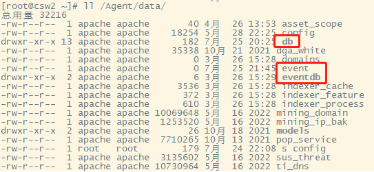

## 前言
网络流量是网络异常检测的基础，流影系统从数据采集到分析和呈现过程中，产出了丰富的网络特征数据。前面已经介绍了流影的PCAP证据留存和NetFlow数据格式及采集过程，本文是关于流影中相关数据类型介绍系列文章的第三篇，也是最后总结篇，主要介绍流影中安全告警相关的事件数据类型，如何在流影界面中查看分析各种不同类型的告警事件。

## 告警事件数据简介
流影数据处理和流转呈现明显的分层形式，分别对应了流影的四个功能模块，从下到上经过各个模块的处理，数据量不断减少的趋势，如下图所示。

位于最下层的NetFLow和PCAP数据，由流影探针ly_probe采集，其中NetFlow数据通过UDP分发传输，被接收后存为本地文件；PCAP直接存为本地文件。这方面内容请参见前面发布的[NetFlow应用](https://abyssalfish-os.github.io/news/netflow/)和[PCAP留存](https://abyssalfish-os.github.io/news/pcap/)两篇文章。

ly_analyser是流影的负责数据分析处理和离散事件检测，输入为带自定义扩展字段的NetFlow v9格式数据，经过特征提取、各种异常行为模型检测，输出会话特征数据和离散威胁事件。这些数据存放于分析节点的本地文件系统和嵌入式数据库Unqlite中，供上层管理引擎拉取使用。分析引擎输出的会话特征数据，主要包括基本五元组、TCP FLAG、数据量特征、HTTP头部信息、DNS解析信息、ICMP报文载荷、资产指纹、威胁标记等信息；分析引擎集成了各种威胁行为检测模型，包括统计类模型、威胁情报匹配模型、机器学习模型和包检测四大类，这些模型输出各种离散事件，包括扫描、挖矿、命令执行、隧道通信、服务外联、各种注入等威胁行为的离散事件。分析节点目录/Agent/data/db存储了通用会话特征；目录/Agent/data/eventdb 存储事件相关会话特征；/Agent/data/event存储了离散事件数据，如下图所示：

查看其中的/Agent/data/eventdb目录，数据文件形式如下图所示：

ly_server管理引擎从分析引擎定时拉取离散事件和会话特征数据，不同的事件按照相应的关键字key进行关联聚合，最终生成告警事件及其会话特征数据。将离散事件、会话特征、聚合事件存入关系数据库MySQL(MariaDB)之中，数据库名称为server，数据表`t_event_data`存放离散事件，`t_event_data_aggre`存放聚合事件，管理引擎提供API数据接口给可视化界面调用，这也是管理节点被称为server的主要原因。进入数据库后台可以查看其数据表和结构，如下图所示。

ly_vis可视化界面的事件区域集中展示了事件告警信息，包括统计分布趋势和分类告警事件列表，对威胁事件的发生、发展和原因进行了详情页展示，根据不同事件类型，展示不同信息，比如DNS隧道、域名情报等告警，额外展示域名信息；扫描事件告警，聚合显示被扫描目标；通过不同事件配置的威胁程度，标记告警级别。通过告警的最近时间信息，标记该事件是否活跃。事件详情展示告警行为详细时序变化、TCP主动握手时序分布、事件相关会话特征等方面信息。以易于理解的方式进行了解读式的可视化呈现，方便用户分析确认，并提供事件报告查看和下载，便于生成情报进行共享。

## 告警事件可视化
流影的总览界面显示了威胁告警态势，支持时间范围、告警类型的组合过滤，提供Top受影响目标态势、告警时间态势、Top威胁来源、工作台视图区域。

通过导航栏的“事件”主菜单可以进入事件告警界面，上面为告警事件筛选区，中间区域是事件多维度统计分布情况，下部为告警事件列表。

之前发布的关于流影使用的相关文章包含了各类告警事件的查看和可视化分析介绍。这里简单进行总结整理，不再赘述。文章列表如下：

- [流影之网络扫描行为发现](https://abyssalfish-os.github.io/news/netscan/)
- [流影之威胁情报应用](https://abyssalfish-os.github.io/news/ti/)
- [流影之挖矿检测](https://abyssalfish-os.github.io/news/mining/)
- [流影之DGA域名识别检测](https://abyssalfish-os.github.io/news/dga/)
- [流影之深度包检测（DPI）识别恶意网络行为](https://abyssalfish-os.github.io/news/dpi/)
- [流影之隐蔽隧道通讯行为检测，预警C2和数据窃取](https://abyssalfish-os.github.io/news/tunnel/)
- [流影之NetFlow应用](https://abyssalfish-os.github.io/news/netflow/)
- [流影之网络流量留存](https://abyssalfish-os.github.io/news/pcap/)

以上文章涵盖了流影支持的典型威胁告警的查看分析，并介绍了相关技术背景和具体实现路线图，能够帮助读者深入理解告警事件的形成过程，同时掌握相应事件的查看和分析方法。如果没有看过的话，建议选择感兴趣的章节阅读了解。

## 结语
流影系统集成了对网络威胁行为的告警功能，数据经过分层处理，最终形成精简的聚合事件数据。流影的可视化界面中，对各种告警事件及其相关会话特征进行了可视化展示，让用户更容易看清和看懂网络通信中异常行为，及时做好响应处理。

