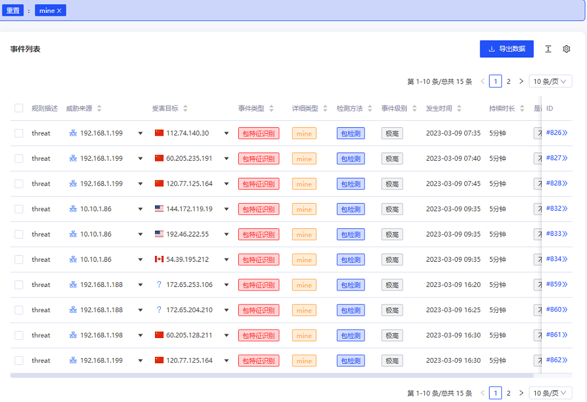

## 前言
近年来数字加密货币泛滥，总交易量逐年攀升，世界大范围涌现了所谓的“挖矿”热潮。数字加密货币交易机制会消耗大量资源，存在诸多弊端。虽然我国国内已经全面禁止非法数字加密货币的“挖矿”行为， 但是仍然存在许多组织或者黑客，为了金钱收益而不断进行非法挖矿。

## 数字加密货币挖矿行为简介
挖矿行为可以分为主动挖矿和被动挖矿。主动挖矿一般是以获取收益为目的，利用自身服务器资源部署挖矿程序，加入比特币交易网络，主动从事挖矿。挖矿收益与算力正相关，发展经历了个人主机、服务器，到近年的专业矿机和矿池。随着国内挖矿的禁令及监管的加强，目前国内矿池基本都被取缔或者迁移到国外了。

被动挖矿是指被黑客植入了挖矿程序，而发生的挖矿行为。这种情况一般比较隐蔽，相当于窃取了受害者的服务器算力资源，而且受害者往往不容易发现。挖矿木马是黑客最常用的植入式挖矿程序，黑客通常可以通过远程漏洞利用、账号爆破、恶意植马网站、鱼叉攻击等方式，将挖矿程序布置在受害者数字资源网络中，获取挖矿收益。挖矿程序种类多样，基本都开源，很容易被恶意封装，如CNRig、XMRig等；还有网页挖矿代码，一般是JS代码隐藏在网页中，当用户访问时，会自动运行挖矿代码，比如coinhive和jsecoin等。

不管是主动或是被动挖矿，挖矿过程包括矿机登记、账号传递、挖矿任务获取、任务提交、挖矿难度调整等，涉及到矿机和矿池的多次网络交互行为，往往通过专用协议进行通信，如stratum协议。一般各“矿主”会将其控制的“矿机”连接到各类“矿池”，不断协同进行挖矿，矿池依据挖矿贡献大小在矿工中分配比特币奖励。

## 流影中挖矿行为检测技术

流影中使用的挖矿检测技术，大体上分成两类：基于情报碰撞和基于流量指纹匹配。如下图所示。

基于情报碰撞的方式，主要利用矿机与矿池通信的IOC进行检出。可利用情报数据包括公开矿池信息和威胁情报中矿池节点IP、域名信息，威胁情报中的挖矿相关的IOC（如挖矿木马主控）。基于流量指纹匹配的方式，对非加密通信流量可行，对加密流量无效。两种方法各有优缺点，能够形成互补效益，结合起来能够形成更好的检测效果。从流量指纹检测出的挖矿行为，确认后可以提取矿池IOC，形成挖矿情报，反馈给情报碰撞检测；情报命中的疑似挖矿行为，可以进一步通过流量指纹匹配进行跟踪，交叉验证。

## 挖矿行为告警查看与分析
流影中挖矿事件是指系统分析检测到用户设备访问数字货币交易平台、连接矿池、接收挖矿任务、提交任务等典型网络挖矿通信行为。登录系统后，在主菜单点击“事件”，筛选查询区域，通过事件类型可以筛选出挖矿事件。如下图所示。

其中mine在系统中标记为“包特征识别”，就是流量指纹匹配出的挖矿行为；挖矿、矿池、XMR等事件类型是情报碰撞出的疑似挖矿行为。下面以流量匹配的挖矿事件进行说明。在页面下方可以查看告警事件列表，如图所示。

选择一个ID后，可以跳转到该事件的详情页面，上方界面显示源、目的资产信息、事件信息、告警行为详细时序图及特征分析数据。

滚动到该事件详情界面最下方，显示TCP主动握手时序特征图和事件特征列表。点击事件列表最左侧的展开按钮，可以查看其指纹匹配特征数据， 如下图所示，mining.subscribe表明是使用stratum协议进行挖矿通信的订阅阶段。

## 挖矿防御建议
1. 及时修复漏洞，防止被植入挖矿恶意程序
2. 避免访问来源不明的网站和邮件链接
3. 加强网络监测，检测挖矿行为，对相关告警及时处置

## 结语
流影基于情报和深度包检测技术，实现挖矿行为的实时监测和及时告警，并将挖矿行为特征以可视化的方式呈现，帮助用户快速定性，有效缩短分析响应时间，能够大大提高挖矿事件的处置效率。

