## 前言
前期一系列文章已经对流影集成的网络行为检测、威胁告警功能进行了比较详尽的介绍，读者朋友们阅读后可以掌握流影的基本功能操作。除了流影集成好的模型、告警规则相关功能，流影还支持用户自定义追踪监控的功能，即用户根据实际需求，对感兴趣的部分流量进行针对性的监控，并可以自定义告警规则，达到持续进行追踪和观测的目的。本文主要介绍追踪监控功能，让大家了解如何通过界面配置流量追踪和监控告警。

## 追踪监控概览
用户登录流影系统后，通过点击主导航栏目的“追踪”菜单，即可进入追踪监控的界面。如下图所示：

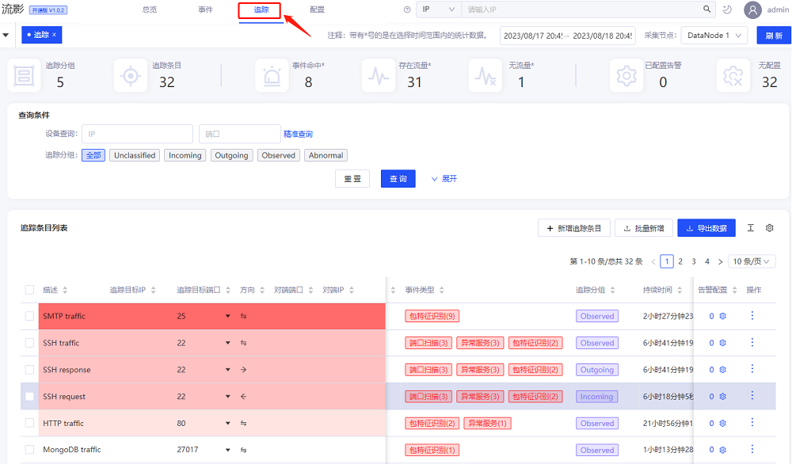

在追踪监控界面主要显示追踪条目的概况，右上角时间范围可以选择时间窗口，采集节点可以进行切换，上面卡片显示了追踪监控分组、条目、告警事件、流量数等卡片样式概览。接着是查询筛选区域，可以对追踪监控条目进行筛选显示，点击展开后如下图所示。

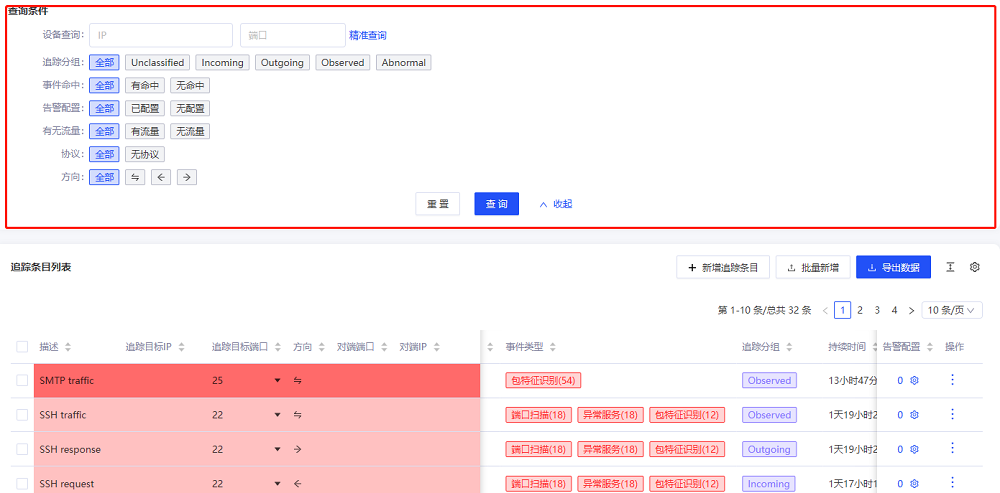

筛选条件包括IP端口、监控分组、是否命中事件、是否配置告警规则、是否有流量、协议以及流量方向。用户选择条件后，点击“查询”，下方追踪条目列表即显示符合条件的结果。监控列表如下图所示：
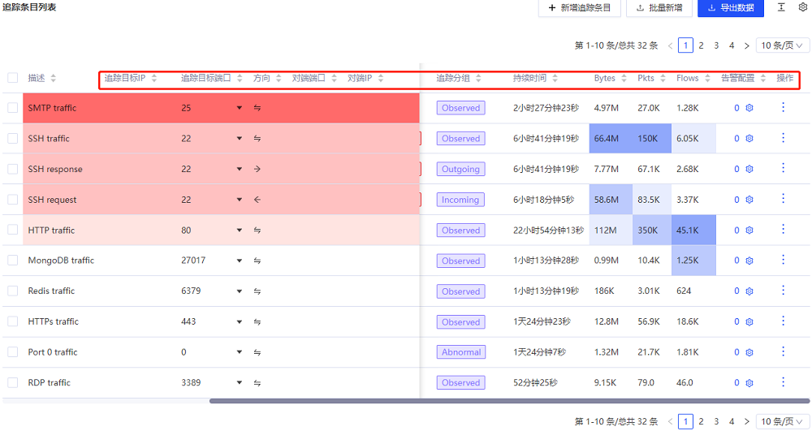

该列表按照命中内置威胁告警规则的情况，使用了颜色深浅进行高亮标记。列表显示的主要信息包括追踪监控的目的IP、目的端口、源IP、源端口、分组、持续时间、流量大小、包数量、流数量、告警规则数量及操作选项。默认每页显示10条，通过下方按钮进行设置大小和进行翻页操作。“新增追踪条目”和“批量新增”是添加追踪监控的快捷按钮。导出数据按钮可以将列表数据导出共享。

可以点击其中一个条目，查看相关事件信息，并可以跳转到事件列表页面，如下图所示：
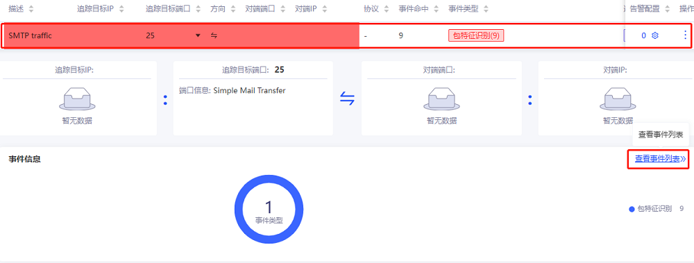

以上就是流影追踪监控功能的简要介绍，下面讲解如何自定义配置追踪监控。

## 自定义追踪监控设置
通过点击主导航栏目的“配置”菜单，选择“追踪”子菜单进入追踪监控配置界面，如下图所示：

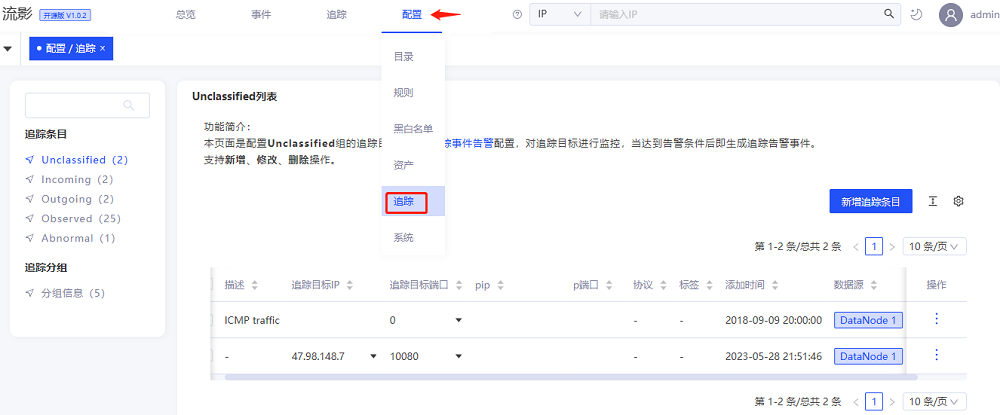

界面左侧是追踪条目及分组，点击可以切换，右侧部分即显示所选分组条目信息。可以新增追踪监控分组和新增监控条目。需要说明的是，登录用户需要具有配置权限，例如系统管理员。下面我们首先建立一个新的监控分组demo:

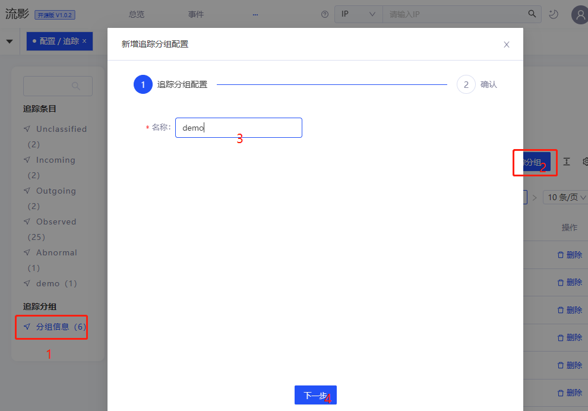

添加成功后，在右侧即可显示已添加的分组，对分组列表中条目可以通过“删除”按钮进行删除。我们在刚才新建的demo分组中添加一条监控，首先选择demo分组，然后选择“新建追踪条目”，弹出新建条目的对话框，如下所示：

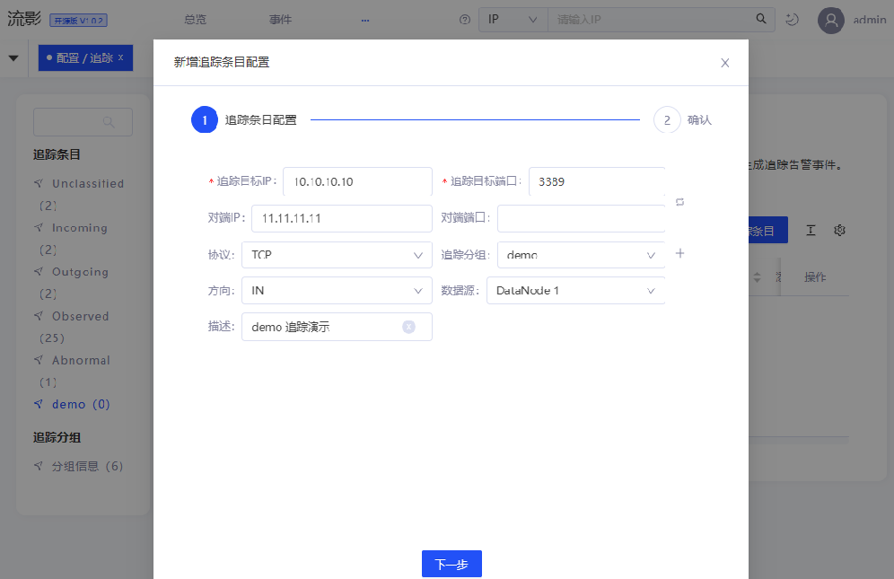

在对话框的表单中填写追踪监控的目标ip、端口、源IP、源端口、描述信息，选择协议类型、流量方向、采集节点，点击下一步进行监控配置确认即可。返回列表，即可看到监控添加成功，点击该条监控，显示该条监控详细内容。通过右侧操作按钮可进行修改和删除。

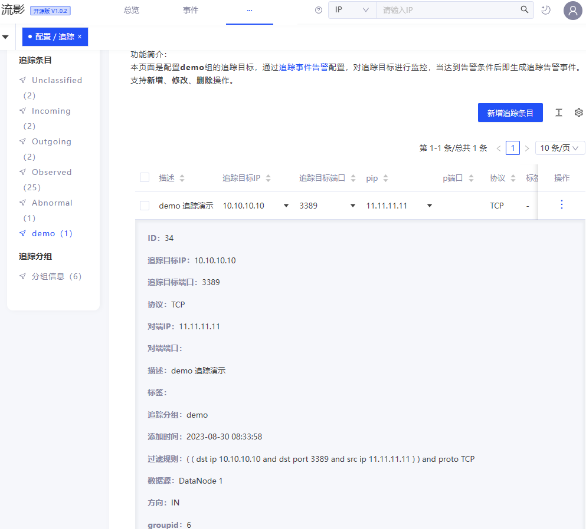

建立追踪监控条目后，还可以进一步对该条目配置告警规则。点击主导航菜单“配置”，选择“规则”子菜单，进入告警规则配置界面，点击右侧告警配置栏目的“追踪事件”选项，右侧显示已配置的监控告警，空列表说明暂无规则。界面右侧点击“新增告警规则”，弹出告警配置对话框，如下图所示：
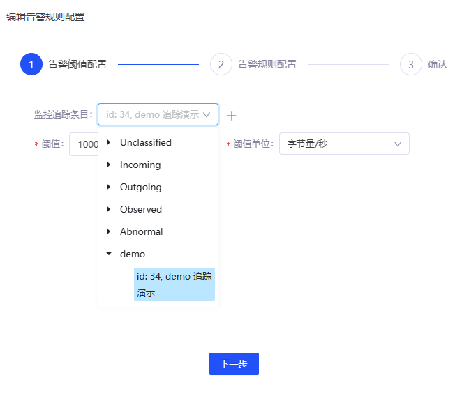

在第1步表单中，选择监控条目，例如刚才新建的demo追踪条目，设置告警规则为流量大小（字节/秒），设置阈值超过1000字节/秒就告警。设置完成后，点击“下一步”。

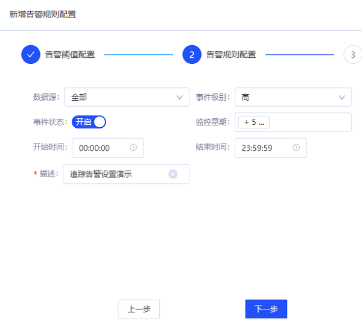

第2步表单中在规则表单中选择数据源、事件级别、是否开启告警、监控日期、监控时间，填写描述信息后，点击下一步进行规则确认，关闭对话框后可以看到该条规则已经显示在列表中。点击该条规则，可以查看规则详情， 如下图所示：

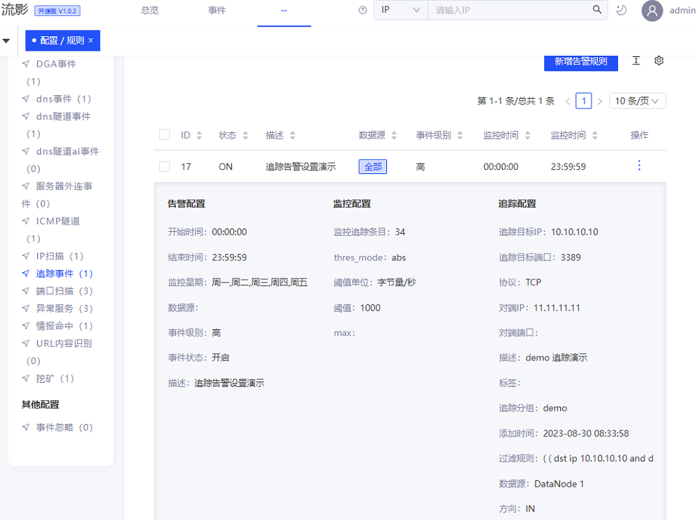

这些配置完成后，按照上文查看“追踪”界面的介绍，进入追踪监控主界面，即可查看刚才配置的监控及告警事件，如下所示：

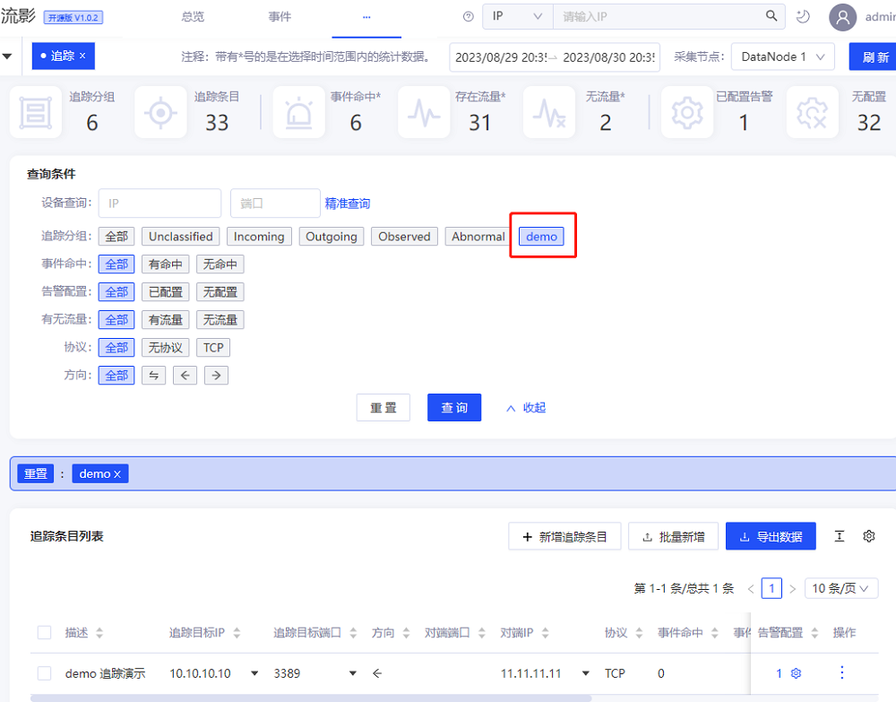

以上演示了设置追踪监控组，在追踪组中添加监控条目，并针对监控条目设置告警规则和查看追踪监控的完整过程。

## 结语
流影系统不仅集成了的内置的威胁行为告警功能，还支持用户自定义进行流量追踪和监控告警的功能。流影的追踪监控界面中，对自定义监控流量及其特征、告警事件进行了可视化展示，让用户更容易洞察网络通信中异常行为，及时做好响应处理，从而降低网络安全威胁风险。

## 相关信息
欢迎大家使用流影和参与项目贡献。流影广泛适用于各种网络安全防护场景，包括不限于入侵检测、威胁狩猎、攻防演练、网络证据留存、网络行为调查分析、态势感知等。如果有定制化商务需求，欢迎联系合作。
- [流影项目主页](https://abyssalfish-os.github.io/)
- 邮箱：opensource@abyssalfish.com.cn
- 扫码进入微信群

