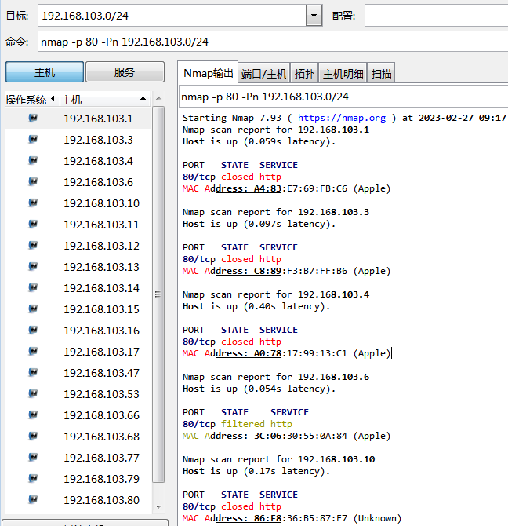
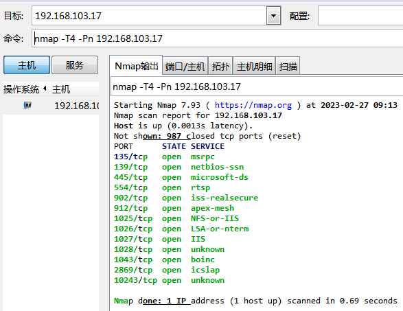
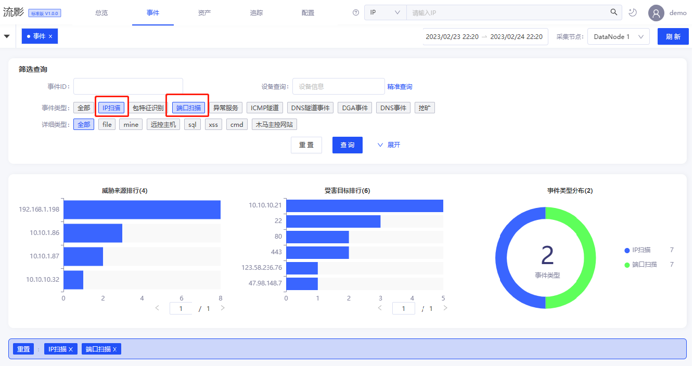
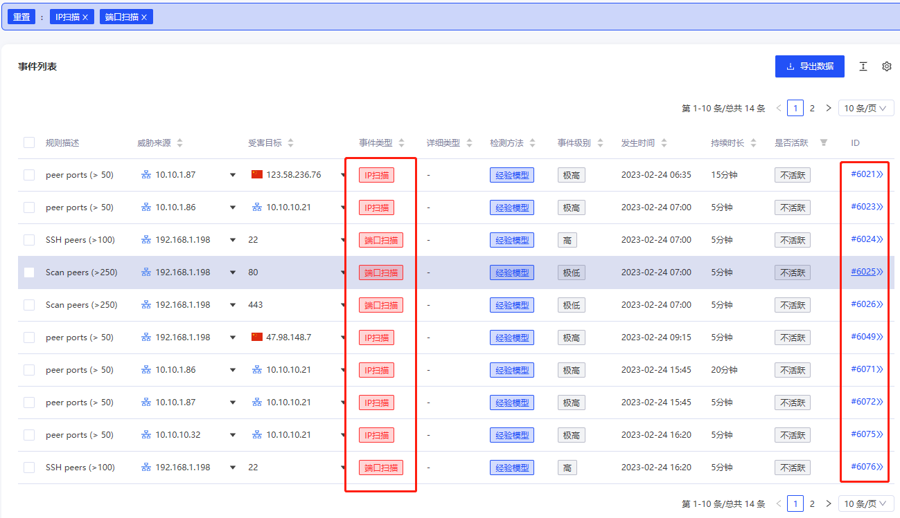
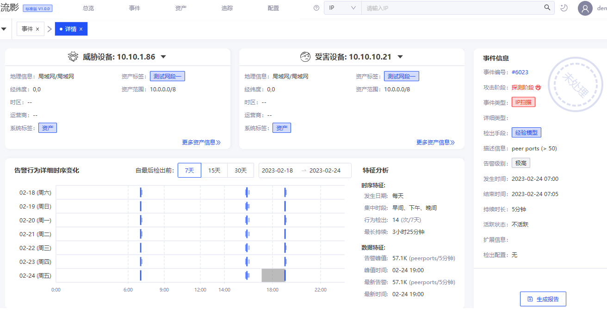
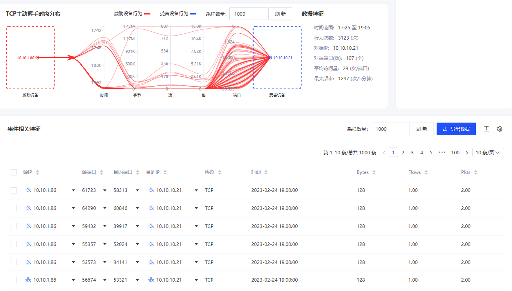
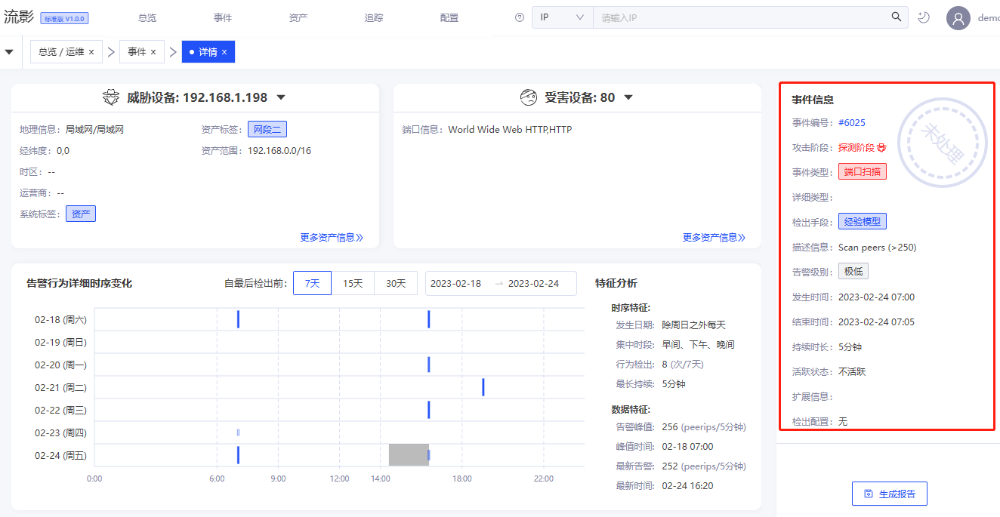
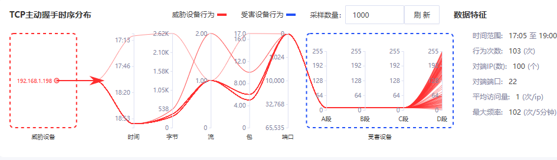
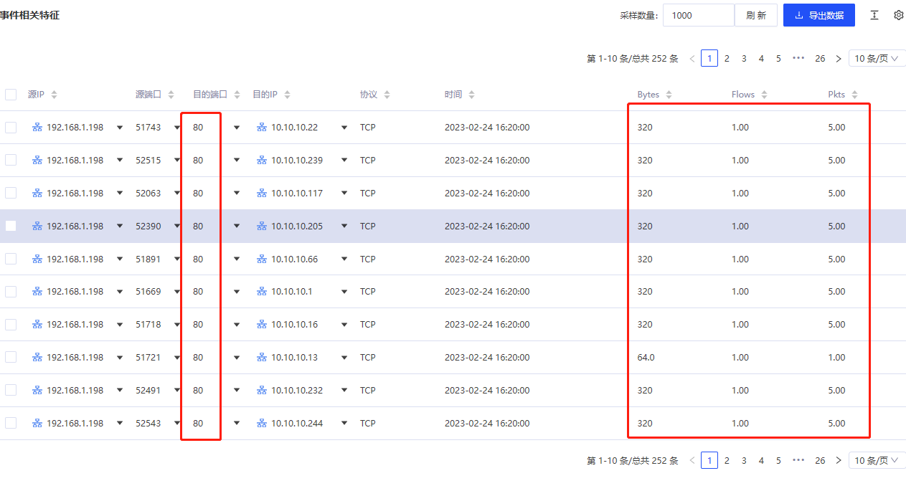
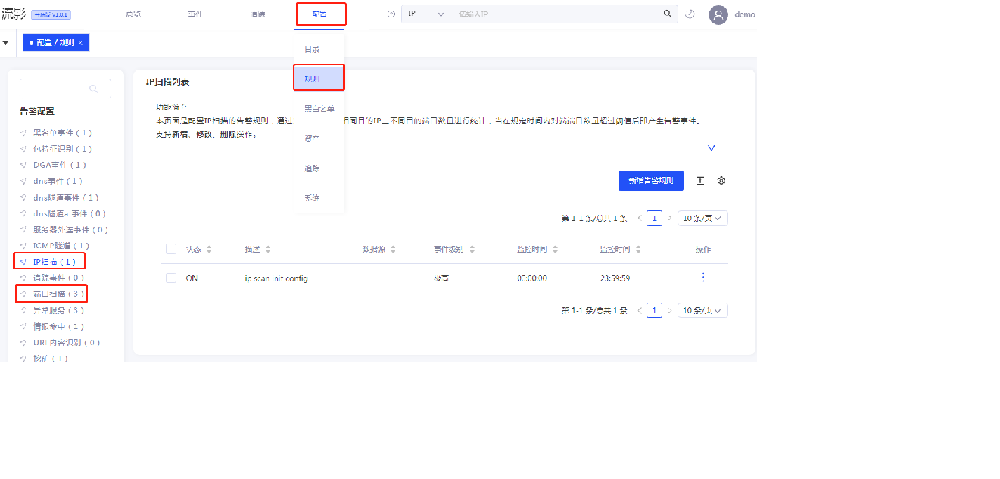

## 前言
流影已经开源2个月左右，陆陆续续收到了大家的一些安装使用反馈，其中不乏一些很好的建议，例如录制教学视频、制作docker镜像或虚拟机、增加大屏展示等。
这些方面我们已经开始跟进，有些已经列入后续工作计划。需要说明的是，由于目前人力有限，相关工作推进不如预期那么快。同时，我们欢迎大家积极参与这个开源项目并积极贡献，壮大社区力量，从而不断推动流影完善迭代。

为了使大家了解流影的功能，我们会不定期发布一些使用介绍使用方面的blog。之前已经发布过一篇介绍[流影中应用威胁情报](https://abyssalfish-os.github.io/news/ti/)的文章，没有看过的伙伴可以浏览一下。本文是第二篇介绍性文章，主要讲解通过流影发现网络扫描行为的使用，相关规则配置方法。

## 网络扫描简介
网络扫描是实现网络目标信息收集的重要手段之一，是一种十分常见的网络行为。网络扫描不一定都是恶意行为，主要看使用者的目的。
一方面，安全人员合理使用网络扫描进行服务监测、网络资产盘点、辅助内网漏洞扫描发现等行为，都是良性的正常行为；另一方面，
黑客或攻击者在实施网络攻击的过程中，会不断通过网络扫描技术收集攻击目标信息、扫描目标漏洞，为实施后续攻击做准备，这种网络扫描是恶意的，有可能对目标造成威胁，是需要重点关注的网络扫描行为。

黑客进行网络扫描的过程，一般是踩点后发现目标的存活主机，收集目标主机操作系统信息、开放端口、运行服务的版本信息、网络拓扑，进而发现目标漏洞和脆弱性。以便后续开展漏洞利用，进入目标网络达成攻击。

### 常见扫描工具
扫描工具以主动式为主，一般过程是主动向扫描目标发送探测包，收集响应包，根据响应指纹匹配，最后输出扫描结果。
如Nmap是一款开源的扫描工具，能够快速的扫描大范围的设备并且能提供比较全面的关于网络目标的信息。Nmap扫描探测示例：

其他扫描工具，如Zmap、masscan、rustscan等也是类似于nmap的扫描工具。Nessus是一个功能强大而又简单易用的网络安全扫描工具，可以扫描选定范围内的主机的端口开放情况、提供的服务、是否存在安全漏洞等。

## 使用流影分析网络扫描行为
流影基于扫描特征统计技术，实现网络扫描行为发现。支持扫描行为识别规则自定义配置，并对网络扫描行为进行了可视化呈现，让用户一眼就能确定网络扫描行为。

流影中扫描事件包括IP扫描和端口扫描两类。
- IP扫描：针对一个IP地址的扫描行为，主要特征是目标IP上大范围端口的探测，一定时间窗口内出现大量相同特征的探测包。攻击场景下，这种扫描行为说明目标很明确，正在寻求突破口。
- 端口扫描：针对部分端口（服务）的扫描，主要特征是目标是一个IP段或者范围，一定时间窗口内出现大量相同特征的探测包。攻击场景下，这种扫描行为可能说明攻击者掌握某个服务的漏洞，正在广泛搜集可入侵的目标。

### 如何在流影中查看和判定网络扫描行为
登录系统后，点击事件主菜单，进入事件告警界面。如果系统已经发现了扫描事件，在筛选区的“事件类型”下，会显示IP扫描和端口扫描的复选标签项。如果没有标签项，说明暂无相关事件类型。如下图所示，表明系统检出了多种类型的事项，两种扫描行为都有事件，可以选中多种事件类型，系统相应进行关联筛选。

柱状图显示事件源和目的事件排行，饼状图显示事件分布情况，最下方是事件列表信息。

点击事件ID可以查看该告警事件详情信息，包括源、目的基本信息、事件时序特征和数据特征，如下图所示：

对TCP会显示主动握手的时序分布图，从左到右显示源、发生时间、数据包字节大小、流的数量、数据包个数、目的端口分布、目的地址，并显示扫描相关特征列表，让用户一眼就能看懂，辅助对这个事件进行判定。如下图所示，某个ip上的高位端口范围上有大量特征相同的数据包，表明进行了扫描探测。

返回事件列表，选择一个端口扫描的事件进行详情查看，如下图所示：

从时序图可以明显看出其扫描行为的分布情况：

最下方的列表显示行为统计特征信息：

### 自定义扫描识别规则配置
系统支持对两种扫描行为的规则自定义配置。（管理员用户）登录系统后，点击配置主菜单，选择“规则”子菜单，进入规则配置与查看界面。

管理员权限的用户可以进行规则维护。配置参数请参见[使用文档](https://abyssalfish-os.github.io/user-manual/peizhi/#ip%e6%89%ab%e6%8f%8f)。

## 网络扫描防护建议
为了防范恶意网络扫描的危害，建议综合进行以下措施：
1. 减少端口开放，加强系统防护
2. 端口伪装，进行信息欺骗
3. 实时监测扫描行为，及时告警和处置

## 结语
在网络安全防护的场景下，尽早的发现黑客的扫描活动，才能及时采取措施，阻断黑客进一步实施后续攻击和破坏，避免损失。

流影可以感知网络扫描行为，支持用户自定义配置检测规则，及时发出网络扫描行为告警，并将扫描行为特征以可视化的方式呈现，帮助用户快速判定，大大减少分析响应时间，提高分析处理效率。

## 其他信息

- [开源流影项目主页](https://abyssalfish-os.github.io/)
- 邮箱：opensource@abyssalfish.com.cn
- 扫码进入微信讨论群


