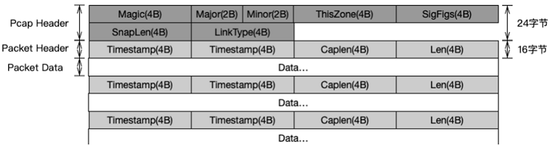
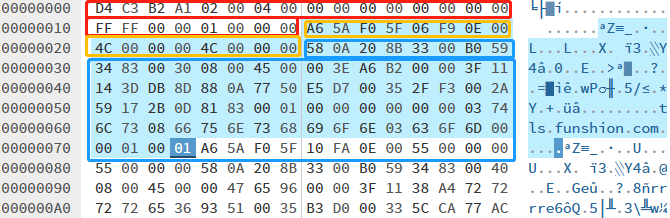
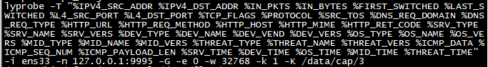
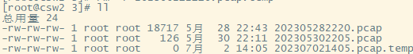
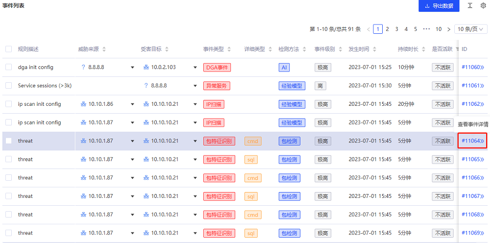
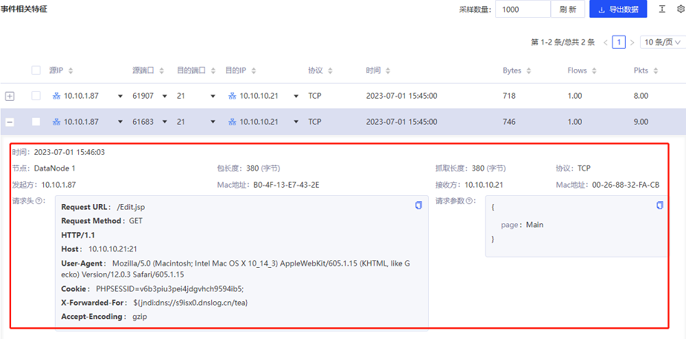

## 前言

本文是关于流影中相关数据类型介绍系列文章的第二篇，主要介绍流影网络行为证据留存概要及其应用。
网络原始流量是网络行为分析识别的基石，流影系统从数据采集到分析和呈现的过程中，产出和留存了丰富的网络数据类型，其中包括原始流量的PCAP留存。需要指出的是，流影并没有选择全流量留存的方式，而是针对性的留存了可疑网络行为相关的流量。

## PCAP概述
PCAP(Packet Capture)是一种网络流量数据报文捕获技术，封装了操作系统底层的网络抓包接口，通过调用统一接口可以捕获目标网卡上数据帧，并存储为PCAP格式数据文件。比如Unix类系统主要使用libpcap库，而Windows系统主要使用WinPcap，进行网络流量捕获和网络流量PCAP留存，文件扩展名一般为pcap。

网络流量留存一般应用于网络流量分析、网络性能优化和网络安全等领域。PCAP格式网络流量留存是比较成熟和常见形式，许多网络监控和数据分析软件都支持PCAP格式，如tcpdump、Wireshark等。

```
+---------------------+
| 文件头 (PCAP Header) |
|---------------------|
| 数据头 (Packet Header) |
|---------------------|
| 数据包 (Packet Data) |
|---------------------|
| 数据头 (Packet Header) |
|---------------------|
| 数据包 (Packet Data) |
|---------------------|
| ...                 |
+---------------------+
```
PCAP格式是一种二进制格式的文件，需要使用支持16进制格式的工具进行打开查看。每个PCAP文件包含一个文件头和一个或多个数据包头和数据包。在PCAP文件中，数据包头和数据包是交替出现的，每个数据包头后面紧跟着对应的数据包。数据包头包含了对后面数据包的描述信息，而数据包则是实际的网络数据帧。PCAP具体格式如下图所示：




以下是PCAP文件头中各个字段含义：

- Magic Number: 标识PCAP文件的格式和字节顺序
- Major: 主版本号
- Minor: 次版本号
- This Zone: 本地标准时间
- SigFlags: 时间精度
- Snaplen: 捕获数据包的最大长度
- LinkType: 网络链接类型，如以太网、令牌环等


数据包头（Packet Header）字段：
- Timestamp: 高位时间戳，精确到秒
- Timestamp: 低位时间戳，精确到微秒
- Caplen: 捕获数据帧长度
- Len: 实际数据帧长度

数据包(Packet data)是链路层的数据帧，其长度是Packet Header中定义的Caplen值，
数据包实际内容是标准的网络协议格式，包括IP报文、TCP报文、UDP报文等。
以下是一个用16进制编辑器打开的PCAP文件示例：



上图中红色框内是PCAP文件头，黄色框内是数据头，蓝色框内是一个数据帧。

以上就是对PCAP格式数据的简要介绍。当然，网络流量的留存还有其他方式和格式，
例如cap、pcapng等，这里不再过多说明。流影系统集成了网络数据包留存功能，
采用的是PCAP相关捕获技术和存储格式。


## 流影之PCAP证据留存
流影网络流量探针ly_probe，集成了PCAP数据包捕获和留存的功能。
该探针基于开源高性能探针nprobe的5.X版本进行了深度定制化开发，
在实际测试和应用中都具有良好的采集吞吐性能，在高速流量场景下仍然能保持比较低的丢包率。
流影并没有选择全流量留存，而是选择性的对可疑流量进行了捕获留存，
避免全流量留存的资源消耗和性能大量损失。

### 流影证据留存概要
流影PCAP留存技术上是使用的是Libpcap库，C语言实现。
流影探针加载了特征规则，采集流量的同时进行规则匹配，
对命中规则特征的单包进行捕获，记入缓存，每五分钟捕获的数据包汇聚为一个文件，
直接以Pcap格式进行留存,文件名记录了时间戳，便于数据包查找。

特征规则放置在流量探针指定目录， 默认情况下为fp-pattern/ 目录，
包含以JSON格式书写的五类规则。

```
service.json    -- 应用层协议与服务识别规则
device.json     -- 硬件设备识别规则
os.json	        -- 操作系统识别规则
midware.json    -- 软件平台与中间件规则
threat.json     -- 异常流量识别规则
```

lyprobe启动时的参数-K指定PCAP的存储路径，默认存储路径配置为/data/cap/3。如下图所示：



留存的PCAP数据包文件如下图所示：



### 流影PCAP留存的应用
PCAP数据记录了原始网络流量完整信息，在流影中主要用于追溯和分析场景：
- 用于对包特征识别结果的验证与追溯
- 作为威胁行为告警的直接证据

流影提供了PCAP查询接口evidence；该接口以数据包微秒级时间戳为key进行查询，
定位和解析数据包，获取数据包MAC、IP、PORT、协议、载荷、包十六进制源数据等信息。
该接口的响应数据如下所示：
```
# 请求示例
evidence?time=1687074364968817&devid=3

# 响应结果示例
[
    {
		"devid": 3,
		"time_sec": 1687074364,
		"time_usec": 968817,
		"caplen": 531,
		"pktlen": 531,
		"smac": "B0-4F-13-E7-43-2E",
		"dmac": "00-26-88-32-FA-CB",
		"sip": "10.10.1.87",
		"sport": 62766,
		"dip": "10.10.10.21",
		"dport": 21,
		"protocol": "TCP",
		"payload": "GET /faq.php?action=grouppermission&gids[99]=%27&gids[100][0]=)%20and%20(select%201%20from%20(select%20count(*),concat((select%20concat(user,0x3a,md5(1234),0x3a)%20from%20mysql.user%20limit%200,1),floor(rand(0)*2))x%20from%20information_schema.tables%20group%20by%20x)a)%23  HTTP/1.1..Host: 10.10.10.21:21..User-Agent: Mozilla/5.0 (Macintosh; Intel Mac OS X 10_14_3) AppleWebKit/605.1.15 (KHTML, like Gecko) Version/12.0.3 Safari/605.1.15..Accept-Encoding: gzip....",
		"pkthdr": "3cb68e6471c80e001302000013020000",
		"packet": "00268832facbb04f13e7432e08004500020500004000400619740a0a01570a0a0a15f52e0015252a26790626eaf08018080ae9ce00000101080a7d09755b25614610474554202f6661712e7068703f616374696f6e3d67726f75707065726d697373696f6e26676964735b39395d3d25323726676964735b3130305d5b305d3d29253230616e642532302873656c6563742532303125323066726f6d2532302873656c656374253230636f756e74282a292c636f6e636174282873656c656374253230636f6e63617428757365722c307833612c6d64352831323334292c307833612925323066726f6d2532306d7973716c2e757365722532306c696d6974253230302c31292c666c6f6f722872616e642830292a3229297825323066726f6d253230696e666f726d6174696f6e5f736368656d612e7461626c657325323067726f75702532306279253230782961292532332020485454502f312e310d0a486f73743a2031302e31302e31302e32313a32310d0a557365722d4167656e743a204d6f7a696c6c612f352e3020284d6163696e746f73683b20496e74656c204d6163204f5320582031305f31345f3329204170706c655765624b69742f3630352e312e313520284b48544d4c2c206c696b65204765636b6f292056657273696f6e2f31322e302e33205361666172692f3630352e312e31350d0a4163636570742d456e636f64696e673a20677a69700d0a0d0a"
	}
]
```

该接口提供的PCAP相关信息，被集成到前端界面之中，
用于证据展示，便于用户查看、分析使用。
例如，从演示环境中查看其中一条包特征识别告警：



点击最后一列的告警事件ID，进入告警详情页面，在下方的事件特征列表中，点击列表第一列的展开按钮，
可以查看解析后的数据包信息， 如下图所示。
该事件payload命中了jndi特征串，疑似为log4j漏洞利用攻击，可以结合其他告警或设备日志进一步确认。


值得一提的是，可以将用户通过其他方法留存PCAP数据导入流影进行分析，
比如可以使用tcpreplay等流量回放工具，将PCAP数据打到流影探针监听的网卡接口，
这样就可以在流影界面看到对应的分析结果。
开源版暂未在界面中提供该功能，商业版可以支持定制化开发集成。


## 结语
PCAP数据记录了完整网络通信信息，是网络行为分析的最原始和直接的证据。
流影系统集成了网络流量PCAP留存功能，流影并没有选择全流量留存，
而是针对可疑网络行为流量进行了捕获留存，避免探针的大量资源消耗和性能损失。
流影的可视化界面中，对告警事件的PCAP数据进行了解析展示，
便于用户从直接的数据证据中发现威胁，让用户更容易看清和看懂网络通信中异常行为。

