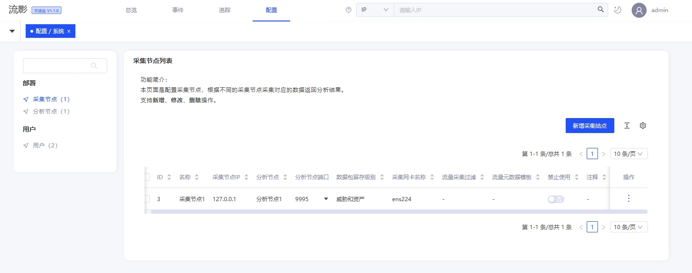
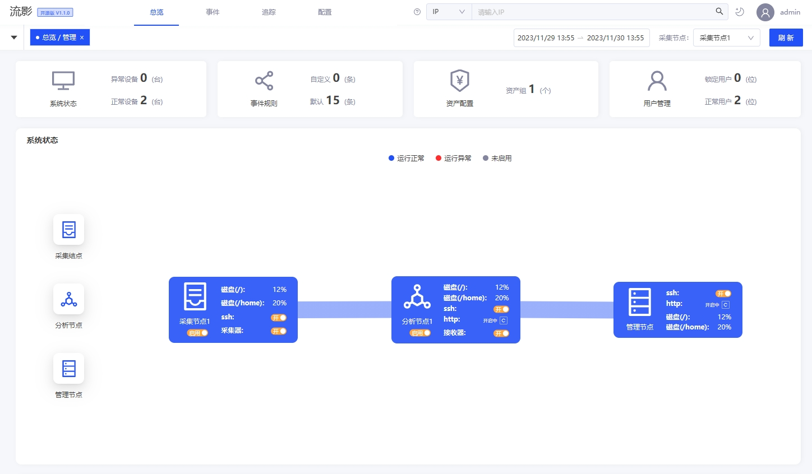

## 前言
针对前期收集的部分需求和发现的问题，近期我们对开源流影进行了一次小版本迭代。本次迭代更新主要进一步优化了配置管理参数设置，解决了管理页面历史遗留问题。最新发布版本为V1.1.0，[安装包和VM镜像](/downloads)已经同步更新，欢迎大家下载最新版试用。下文对本次主要更新功能进行简介。

## 配置项优化
在“配置-系统”页面中，优化采集节点配置项描述，新增可以配置采集节点的监听网卡名、数据包留存级别、流量过滤条件、流量元数据模板，具体参见下图所示。(提示：请使用具有管理配置权限的账号登录系统进行体验)

配置项简介：
- 分析节点端口：指定所采集的流量数据发向分析节点的端口。
- 数据包留存级别： 指定探针留存数据包级别，包括不留存数据包、仅留存被后台威胁特征规则命中的数据包、留存威胁特征与资产特征命中的数据包、为每个会话留存第一对有内容的数据包，共计4个级别。
- 采集网卡名称：可在web端页面直接配置采集网卡名。注意核实网卡信息后再行配置。
- 流量采集过滤：可配置符合BPF语法（也常用于Tcpdump / Wireshark等工具进行过滤流量）的流量过滤语句，会在采集流量时进行应用。
- 流量与数据模板：可自行设置流量探针所产生的Netflow数据模板。如非必要，谨慎配置。

在本管理配置界面，通过配置以上信息，即可直接调整探针运行参数，进行管理操作，更便捷。

## 节点启停管理优化
在“总览-管理”页面中，后台接口进行优化，调整了节点展示项，修复此前存在的启停按钮稳定性问题。新版本可以正常通过界面管理探针节点运行，不必再频繁使用后台命令控制探针启停了。

管理页面图卡中，采集节点放置采集器（探针、lyprobe）状态信息，此处的启停操作可直接应用配置页面的参数，对采集器进行启动、停止操作管理。
	
分析节点放置接收器（nfcapd）状态，接收器接收采集器的数据，两者同时处于运行状态后台数据才能持续生成。

## 更新说明
由于后端部分功能进行了重新开发，本次更新与V1.0版本不兼容，升级部署请使用v1.1.0版依赖环境，建议重新安装部署最新版本。

