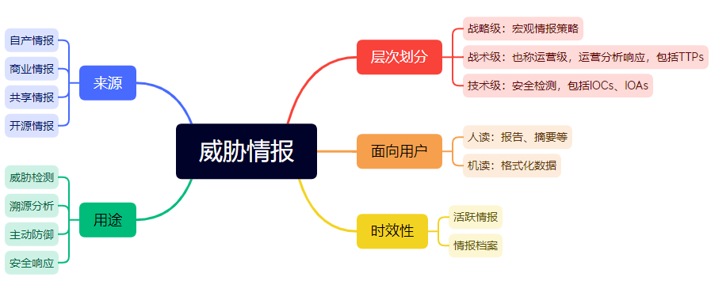
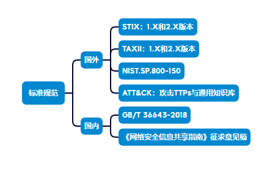
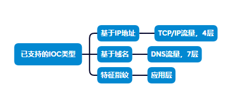
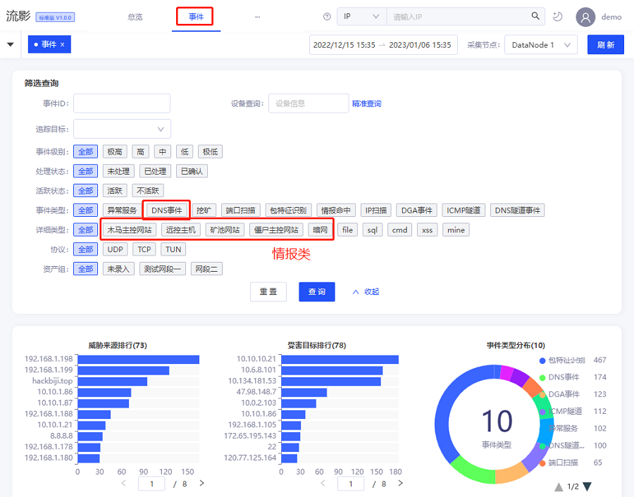
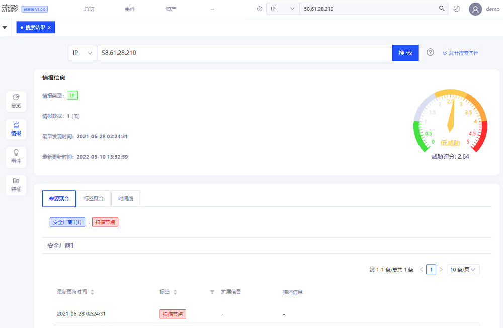
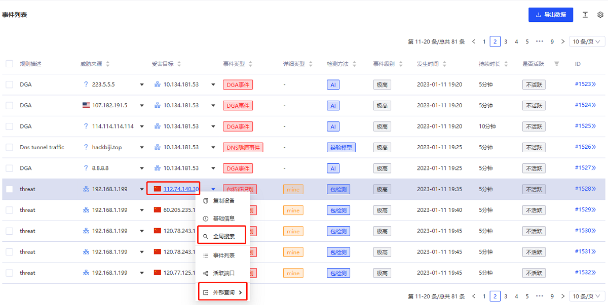
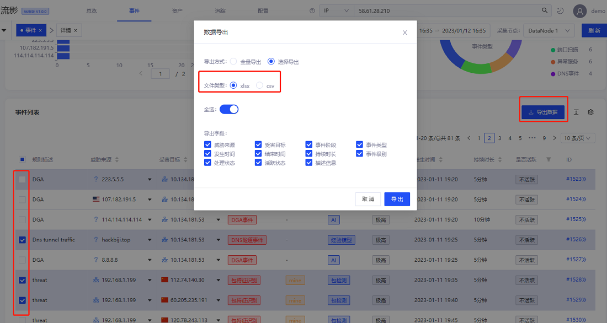

流影是开源的基于流量的网络行为可视化分析平台，功能架构灵活可扩展。
威胁情报在安全检测与防御的实践应用中能够发挥很大作用。
流影支持多种网络威胁行为的检测方式，也支持威胁情报这种基本的检测方式。
流影通过威胁情报的集成应用，方便用户能够灵活接入自产或采购的情报数据，
实现基于情报的威胁检测告警、威胁分析功能。

为了更好的让用户了解威胁情报在流影中的应用，撰写此文，主要涵盖以下方面内容：
* [威胁情报概述，对齐威胁情报的理解和术语](#威胁情报概述)
* [在流影中查看威胁情报告警事件](#基于情报的威胁行为检测功能)
* [使用流影集成情报检索功能进行威胁行为分析](#流影集成情报检索功能支持威胁行为分析)
* [通过流影生产威胁情报](#流影产出威胁情报)

## 威胁情报概述

威胁情报的概念自从Gartner提出后，迅速兴起和备受安全领域各界关注，应用发展至今已经大概10年之久，
威胁情报在世界各行业、组织机构的安全发展过程中的确发挥了很大作用，这个过程其实体现了数据驱动各种生产力发展的大浪潮。

威胁情报目前仍然是国内外安全领域研究和应用的热点，相关市场份额逐年增高。
威胁情报应用比较广泛，当前许多安全产品或者解决方案的介绍中，都能发现威胁情报的身影。
经过近10多年的发展应用，目前各行业的安全从业人员对威胁情报的概念都比较熟悉或者了解了，
对威胁情报的作用有了比较深刻的感受，大部分中大型企业基本都建立了自己的威胁情报运营中心，
或者将威胁情报数据加入了年度预算进行采购。

为了对齐大家对威胁情报的理解，下面首先对威胁情报做一个简单的概要介绍。

### 威胁情报含义

威胁情报目前并没有统一明确的定义，而且不同的时期、
不同的厂商和不同研究人员对其定义或者描述不尽相同。

* Gartner在2013年提出威胁情报给出了初始定义，
而后在2014年Gartner的 《Market Guide for Security Threat Intelligence Service》
（安全威胁情报服务市场指南）报告中又进行了简单修订：
威胁情报是一种基于证据的知识，包括情境、机制、指标、影响和操作建议等方面。
威胁情报描述了已经发现的、或者将来会出现的威胁或危险，并可以用于通知主体针对相关威胁或危险采取某种响应。

> Threat intelligence is evidence-based knowledge, including context, 
> mechanisms, indicators, implications and actionable advice, 
> about an existing or emerging menace or hazard to assets 
> that can be used to inform decisions regarding the subject's 
> response to that menace or hazard.

* 2015年，Jon Friedman和Mark Bouchard 发表的《Definitive Guide to Cyber Threat Intelligence》
（网络威胁情报权威指南）白皮书中对威胁情报的定义：威胁情报是通过各种方式收集、分析、传播扩散的关于攻击者的动机、企图和方法的知识，
使得各层级的安全和业务职员用来保护企业关键资产。

> Cyber threat intelligence is knowledge about adversaries and their motivations, intentions, and methods that is collected, analyzed, 
> and disseminated in ways that help security and business staf 
> at all levels protect the critical assets of the enterprise.

* 美国SANS研究院对其定义：威胁情报是关于安全威胁、恶意攻击者、漏洞利用、恶意软件、漏洞信息和攻陷指标等方面，
所收集的用于评估和应用的数据集。
> Threat intelligence is the set of data collected, 
> assessed and applied regarding security threats, 
> malicious actors, exploits, malware, vulnerabilities and compromise indicators.

* 咨询公司Forrester对其描述：威胁情报是针对内部和外部威胁源的动机、意图和能力、
内外部攻击组织的详细叙述，包括了敌手使用的技战术（TTPs）。

> Threat intelligence is details of motivations, intents, and capabilities of 
> internel and external threats actors. TI includes sepecifics on the TTPs of these adversaries.

* 安全厂商CrowdStrike的描述：威胁情报是为了理解威胁攻击者的动机、目标和攻击行为而收集、处理和分析的数据。
> Threat intelligence is data that is collected, processed, 
> and analyzed to understand a threat actor's motives, targets, and attack behaviors. 

从上面可以看出，有的定义比较宽泛，有的相对具体和狭义。
广义上的威胁情报，基本可以说是普遍的网络安全情报，内容比较宽泛，包括不限于狭义的资产情报、威胁情报、
漏洞情报、安全事件情报及基础信息知识情报等方面内容。

在安全行业业内，大多数情况下所说的威胁情报指的是狭义的威胁情报，
主要是攻击者相关的信息、动机、目标、攻击技战术、攻击指示器IOC等。
特别地，在威胁行为检测场景下，其主要内容特指用于识别和检测威胁的失陷标识（IOC: Indicators of Compromise），
如文件 HASH、IP、域名、程序运行路径、注册表项等低层次技术级威胁情报。
本文后面所述威胁情报，如果没有特别说明，一般也是指狭义的威胁情报，在检测场景下也特指威胁情报相关IOC。

### 威胁情报用途和分类

威胁情报已经广泛被应用在威胁检测、溯源分析、主动防御和安全响应过程中。
通过应用威胁情报，能够提高安全响应的效率，
情报中的相关性和上下文信息能让安全人员快速明确哪些威胁数据是与企业信息资产和业务安全息息相关的，
可以根据威胁的影响程度合理安排响应行动的优先级。

业界从不同的维度，对威胁情报进行了一些分类。

威胁情报按照层次高低可以分为三类，由高至低包括战略级、战术级和技术级情报。
最高级的战略威胁情报，一般是宏观层面的战略级情报，例如攻击组织、攻击动机及目标特点等；
战术级情报也称运营级情报，主要是攻击TTP的知识库；技术级情报一般用于威胁检测实施和响应，
包括IOC（Indicators of Compromise）和 IOA（Indicators of Attack）。

根据威胁情报来源不同，分为内部自产情报、安全厂商商业情报、社区共享情报和开源公布情报。
按照情报使用方式不同，分为机读情报和人读情报。机读情报一般是遵循某种情报数据标准的格式化数据，
可以供计算机读取，以便于进行检测或者响应的自动化集成；
人读情报一般是文章、报告或者安全事件摘要等，供人工查阅研判使用。
按照情报时效性，可以分为活跃情报和情报档案（信誉库、知识库）。
其中活跃情报是指正在或者潜在导致威胁发生的情报，供实时检测和响应使用；
情报档案是归档后的数据集，供查询分析使用。

### 威胁情报相关标准

威胁情报通过广泛扩散使用才能使其价值最大化。
威胁情报的扩散使用，需要各种行业、组织用户的广泛参与和情报交换共享。
情报的共享交换的基础，是建立在情报格式标准规范化及有效共享交换机制基础之上的。
下图列出一些威胁情报相关的国内外主要相关的标准规范。

威胁情报标准化和共享机制，目前国外已经比较成熟，国内也在逐步完善之中。
美国牵头提出的一些标准包括Structured Threat Information eXpression [(STIX)](http://stixproject.github.io/)系列、
Cyber Observable eXpression [(CyboX)](https://cyboxproject.github.io/)、
联邦网络威胁信息共享指南 [NIST.SP.800-150](https://nvlpubs.nist.gov/nistpubs/SpecialPublications/NIST.SP.800-150.pdf)、
Trusted Automated eXchange of Indicator Information [(TAXII)](https://taxiiproject.github.io/)。
还有近年来比较热门的[ATT&CK](http://attack.mitre.org/)框架，是一个不断完善的攻击技战术和通用知识库，
是对已知网络攻击中攻防战术和技术尽可能全面建模描述，支持STIX和TAXII规范，
适用于威胁分析建模、攻防演练、安全评估等场景，具有比较强的实战指导意义。
这些标准规范之间互相联系和支撑，能组合使用，不仅得到美国国防部、国家安全局等政府部门的赞助支持，
主要安全行业机构的也大量参与使用，具有较强的可实践性，
而且相关标准规范在应用中还在不断的迭代优化完善，有些经过1.0版本已经迭代到2.X版本。

近年来，我国对网络安全高度重视，已经上升到国家安全战略高度。
网络信息安全相关国家、行业标准也在不断完善中。
2018年10月，我国发布了威胁情报相关的第一个国家标准《信息安全技术网络安全威胁信息格式规范》(GB/T 36643-2018) 。
2021年12月，国家信安标委发布了《网信息安全技术 网络安全信息共享指南》的征求意见稿，
可以看出威胁信息共享交换的相关标准规范也在制定当中。
从实际应用情况来看，我们的直观感受是国内威胁情报共享交换落地尚处于实践探索阶段，
相关标准有待于进一步迭代完善。
国内威胁情报厂商支持的情报格式以自定义格式居多，少部分支持国标，
但是各厂商的具体实现落地差异性较大，不太统一；
为了与国际接轨，也有部分厂商的威胁情报支持STIX系列标准规范。

当前流影开源版已经实现威胁情报自定义格式的接入和查询，后续规划中考虑增加对符合国内外标准规范的更广泛的威胁情报的支持。

## 流影中应用威胁情报

当前开源流影版本支持部分自定义格式的威胁情报接入，
集成实现了基于威胁情报的威胁行为检测告警、威胁分析、情报生产等方面的功能。

### 流影不只是消费威胁情报，也可以生产威胁情报

在流影中既可以消费使用威胁情报，也可以生产输出威胁情报。
威胁情报在流影中应用主要包括以下三个方面：
* 基于威胁情报的检测告警，支持恶意IP和域名的检测告警
* 基于情报的威胁分析，支持内外部威胁情报检索
* 威胁情报生产，安全人员使用流影分析发现和确认的威胁事件后，可以输出共享威胁情报数据

使用和生产威胁情报，两者相辅相成，互相结合，能够形成良性循环，不断提高流影威胁检测与分析的能力。
一方面，通过多种威胁情报的接入，可以增强流影威胁检测发现和分析能力；
另一方面，流影其他威胁行为识别模型检测出的安全事件，经过安全人员分析确认后，
相关上下文、证据、IOC就可以作为情报输出，生成更多、更丰富的威胁情报数据。
产出的威胁情报，通过在行业内或者社区组织之间的共享交换，还可以发挥出更大的价值。

### 基于情报的威胁行为检测功能

开源流影支持威胁情报IOC的接入，基于情报检测识别威胁行为，输出安全告警事件。
其基本检测原理，是对网络流量进行关键字匹配，对匹配成功的流量上下文、特征进行提取留存，
按照时间窗口生成聚合安全告警列表。

#### 流影接入的威胁情报IOC类型

流影目前支持的IOC类型，包括恶意IP地址、Domain域名和特征指纹等技术比较成熟的情报类型。
其中IP地址是最常用的检测指标，流影中按照威胁标签对相关事件进行分类，例如挖矿事件、命令控制事件C2等类型；
域名检测一般是通过DNS流量，识别恶意域名请求，发现威胁行为，这类告警事件在流影中归类为DNS事件；
特征指纹一般是恶意软件或与其通信相关的特殊标识，
也普遍用于入侵检测，该类检测告警事件在流影中被归类为包特征识别事件。

#### 在流影中查看威胁情报事件告警

当前版本流影前端界面，还没有设计单独威胁情报事件页面，事件列表中检测方法标记为情报的类型，
就是通过威胁情报检测的安全事件。以下以一个dns事件查看为例进行说明。

通过点击事件主菜单进入事件汇总页面，可以通过筛选查询查看dns威胁情报相关事件，如下图所示。

选定时间范围和筛选条件后，在页面下方显示的安全事件告警列表，如下图所示，可以看到其检测方法是情报类型：

列表中显示了事件基本信息，包括检测规则、威胁来源、受害目标、事件类型、细分类型、检出方式、事件级别、
事件时间、持续时长、活跃情况等。

在事件列表中，可以点击具体事件，可以查看该事件的详情信息，包括报警上下文、通信详情信息，如下图所示：

在该事件的详情页面中，可以查看事件基本信息、源目的资产基本信息、告警时序图、通联时序分布、流量特征信息。

## 流影集成情报检索功能支持威胁行为分析

安全分析人员针对安全事件告警信息，往往需要查询更多的情报来进行分析处置，
内外部的威胁情报能够提供线索扩展，辅助事件告警分析，去伪存真。
这主要是针对威胁情报命中事件之外的告警事件而言，例如流影中包检测事件、经验模型判定事件，
通过查询事件相关的内外部威胁情报，进行关联分析，最终确认是否真实威胁行为。
需要说明的是，开源流影当前集成的情报查询时自建情报数据接口，开源版仅限用于开发测试。
外部情报查询，支持跳转到VirusTotal。
在实际生产环境，建议用户使用商业版威胁情报或者自营情报中心的数据。

在流影中，有两种方式进行威胁情报查询，第一种方式是通过全局搜索，如下图所示：

输入检索的IP地址或者Domain字符串，点击检索按钮，即可进入检索详情页面，点击左侧的情报标签，即可查看历史情报档案信息。

该页面显示的情报信息，来源于公司自建的情报接口，开源版可以测试使用。商业使用请单独联系。

第二种查询方式是通过事件列表页的快捷菜单，如下图所示：

在事件列表页，直接点击IP或者Domain，页面显示快捷菜单，选择全局搜索可以进入第一种查询方式；
特别的，这里还支持外部威胁情报查询，目前集成了搜索引擎和跳转VirusTotal的快速查询。

## 流影产出威胁情报
流影本身能够生产威胁情报。安全分析人员通过分析确认后的安全告警事件，即是自产的高时效性威胁情报，
可以共享给社区联盟或者外界使用，输出威胁情报。

流影留存了告警事件的上下文流量特征、原始Pcap包、聚合事件等信息。
在事件列表页面，支持导出事件告警及其上下文信息，如下图所示：

批量选择安全事件进行导出，支持Excel和CSV格式及导出字段选择。

在事件详情页面，支持导出详细报告和通讯特征数据，如下图所示：

## 总结

本文简要介绍了威胁情报在流影中的应用，包括威胁情报基本概念、当前流影支持的威胁情报类型、
流影如何使用威胁情报进行检测和分析、如何通过流影生产威胁情报等方面内容。
一方面，高精准的威胁情报，可以为流影提供强力弹药，
从而命中一些高级别的攻击行为，提升了流影的识别检测能力；另一方面，流影能够留存威胁行为的流量上下文信息和证据，
输出丰富的、高价值流量侧威胁情报。
流影加威胁情报，互相结合，能够相辅相成，达到更好的安全防护效果。

## 展望与规划

当前开源流影在威胁情报的应用还处于初级阶段，
已实现的功能仅仅支持威胁情报中一小部分内容，
除了IP、Domain类型的IOC，还有哈希值、URL、电子邮件等类型IOC；
除了IOC，还有高级别威胁情报TTPs，目前还没有支持。
因此也只能发挥威胁情报少量的作用，还有很大的改进提升空间。

对威胁情报数据类型的全面支持，结合ATT&CK，遵循共享交换标准规范的，能够使流影在威胁分析、共享交换中发挥更好的作用。
这些功能需求已经列入开源版将来的研发规划之中。
相信如果全面地实现这些功能，在流影中进行集成应用，并且不断迭代完善，
一定能够为用户提供全新的安全视角、更好的使用体验。

流影是一个完全开源的项目，欢迎大家广泛参与使用，期待您的贡献。

## 相关信息

- 邮箱：opensource@abyssalfish.com.cn
- [流影项目](https://abyssalfish-os.github.io/)
- [GitHub](https://github.com/orgs/Abyssal-Fish-Technology/repositories)
- [Gitee](https://gitee.com/organizations/abyssalfish-os/projects)
- [Demo地址](http://101.254.236.75:12280/ui/#/login)

## 参考文献

1. [流影Demo](http://101.254.236.75:12280/ui)
1. [流影文档主页](https://abyssalfish-os.github.io/)
1. Gartner, [Market Guide for Security Threat Intelligence Service](https://www.gartner.com/en/documents/2874317), 2014.
1. J. Friedman, M. Bouchard. Definitive guide to cyber threat intelligence[M]. CyberEdge Press, 2015.
1. CrowdStrike, [WHAT IS CYBER THREAT INTELLIGENCE?](https://www.crowdstrike.com/cybersecurity-101/threat-intelligence/)
1. [STIX](http://stixproject.github.io/) 
1. [TAXII](https://taxiiproject.github.io/)
1. [Cyber Threat Intelligence and Information Sharing](https://www.nist.gov/publications/cyber-threat-intelligence-and-information-sharing)
1. [NIST.SP.800-150](https://nvlpubs.nist.gov/nistpubs/SpecialPublications/NIST.SP.800-150.pdf)
1. [ATT&CK](http://attack.mitre.org/)
1. [《信息安全技术 网络安全威胁信息格式规范》(GB/T 36643-2018)](https://www.tc260.org.cn/advice/detail.html?norm_id=20150910115414&norm_iso_id=GB/T%2036643%E2%80%942018)
1. 尹彦,张红斌,刘滨,赵冬梅.网络安全态势感知中的威胁情报技术[J].河北科技大学学报,2021,42(2):195-204.
1. 刘宝旭, 杨沛安, 武杨, 苏莉娅. 网络空间威胁情报共享技术综述. 计算机科学[J]. 2018, 45(6): 9-18,26.
1. Jasper S E. US cyber threat intelligence sharing frameworks[J]. International Journal of Intelligence and CounterIntelligence, 2017, 30(1): 53-65.
1. Bromiley M. Threat intelligence: What it is, and how to use it effectively[J]. SANS Institute InfoSec Reading Room, 2016, 15: 172.

