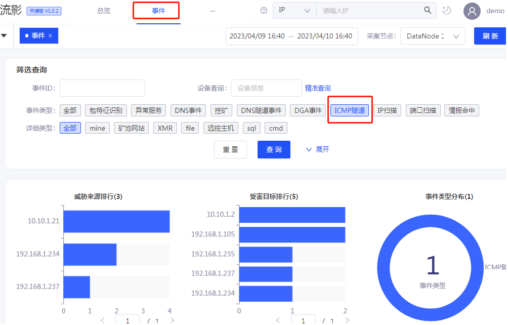
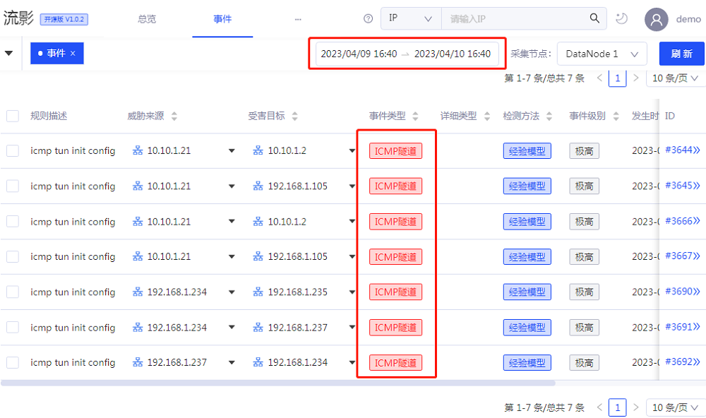
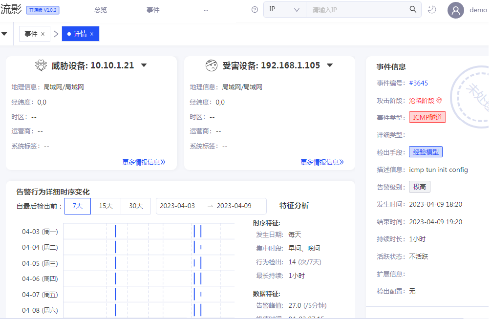
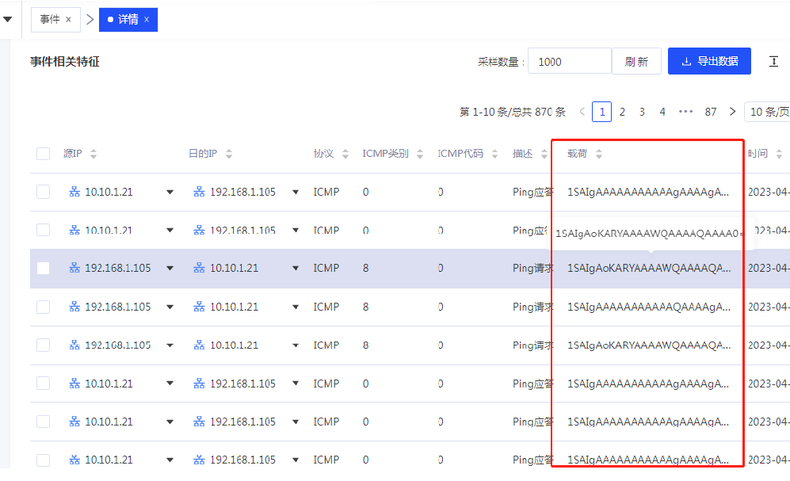
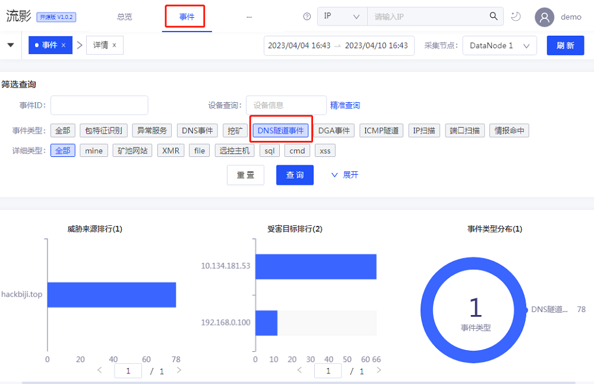
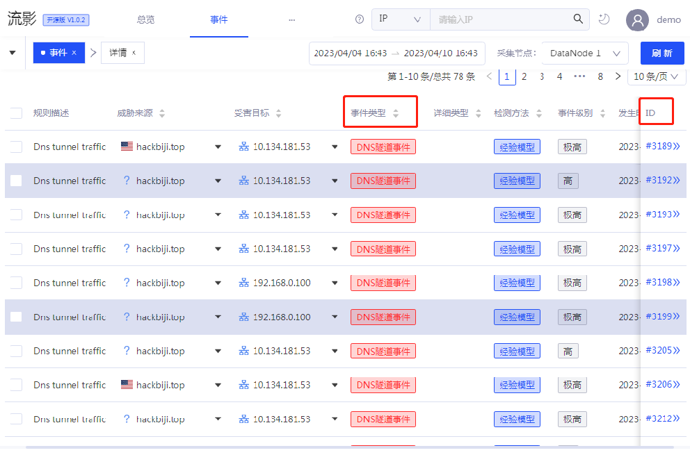
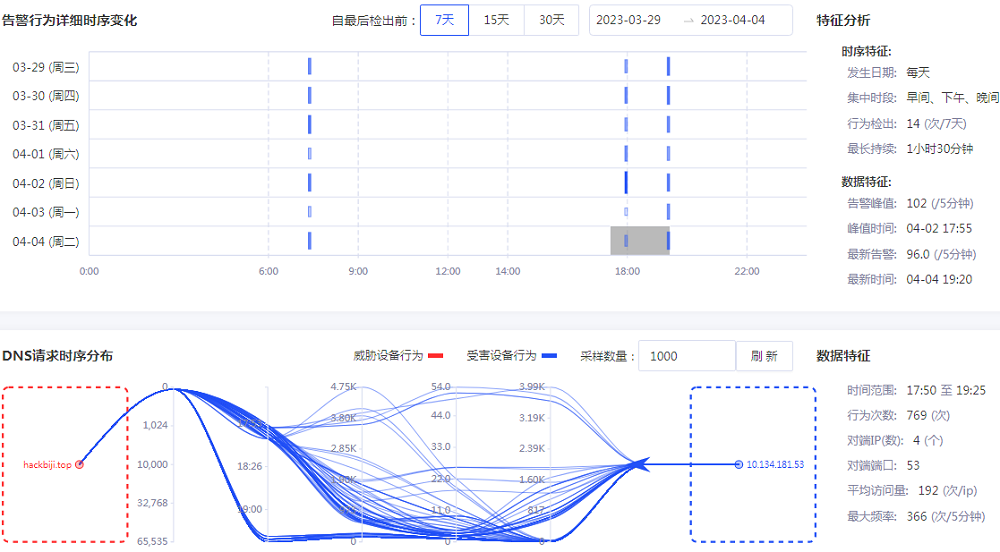
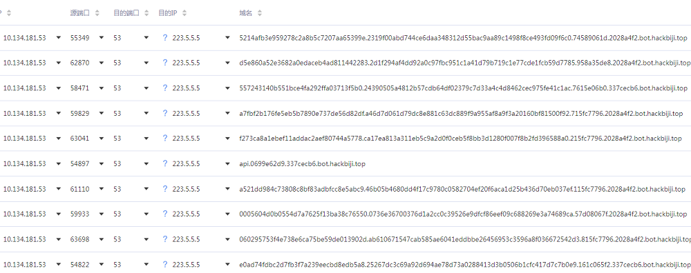
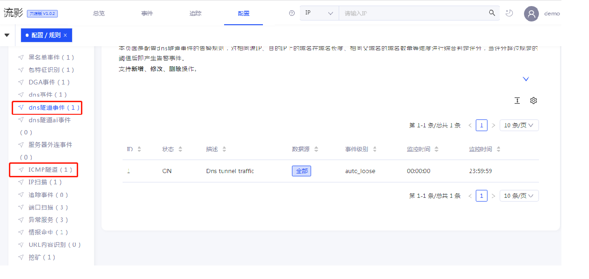

## 前言
本文是关于流影功能使用介绍系列文章之一，主要介绍流影中隧道通讯行为的检测概要、相关告警事件的查看与分析。前期已经发布了多篇功能使用介绍类似性质的blog，建议大家阅读，并在演示demo中进行实际操作，能够帮助大家比较好的理解流影的功能和应用场景。

## 隧道通讯行为简介

网络隧道技术是通过一种网络协议来传输另一种网络协议的通讯技术。网络隧道通讯一般通过网络隧道协议实现，例如用于VPN的各类协议PPTP、LTF、L2TP协议等。

恶意攻击者经常利用网络隧道技术进行隐蔽通讯，达到远程命令控制或者数据传输的目的。攻击者使用隧道协议将数据包封装成防火墙允许通过的数据包类型，绕过防火墙或入侵检测设备，发送到对应的服务器上，到达目标后解封。使用传统的socket隧道通讯目前已经很少了，因为TCP\UDP类型的隧道通讯基本被安全防护系统的策略所拦截。而DNS、ICMP等属于很少会被列为封禁的协议，因此这些协议成为恶意攻击者构建隧道通讯工具的主要协议。

### ICMP隧道通讯

ICMP隧道属于网络层隧道，将TCP/UDP的数据包封装到ICMP的ping数据包中，从而穿过防火墙，实现不受控制的访问。常用的ICMP隧道工具有ICMPsh、PingTunnel、ICMPTunnel、PowerShell ICMP等。

ICMP隧道是一个很特殊的协议，ICMP报文是由系统内核处理的，不占用任何端口，因此具有很高的隐蔽性。在一般的通信协议里，如果两台设备要进行通信，肯定要开放端口，而在ICMP协议下不需要开放端口。 进行隧道通讯的时候，内部主机运行并接受外部攻击端的ICMP_ECHO数据包，攻击端把需要执行的命令隐藏在ICMP_ECHO数据包中，被攻击者接收到该数据包，解封其中隐藏的命令后在内部主机上执行，将执行结果封装在ICMP_ECHOREPLY数据包中，发送给外部攻击端。 在一些条件下，如果攻击者使用各类隧道技术（HTTP，DNS，常规正反端口转发等）操作都失败了，常常会通过ping命令访问远程计算机， 尝试进行ICMP隧道，将TCP/UDP数据封装到ICMP的ping数据包中，从而穿过防火墙（通常防火墙不会屏蔽ping数据包），实现不受限制的网络通讯。ICMP类隧道，经常被应用于窃取信息类的木马后门之中。

从流量上看，ICMP隧道通讯的特征，一般是通讯时刻ICMP数据包数量有大量的增长，数据包Payload一般比较大，请求数据包和响应数据包内容不一致，有的还带有类似TUNL的指纹标记。利用ICMP的通讯特征，可以从流量中进行检测ICMP隧道通讯行为。

### DNS隧道通讯
DNS隧道属于应用层隧道，通过将其他协议封装在DNS协议中实现网络通讯。数据封装一般在客户端进行，服务器进行DNS流量解封成正常的流量。目前攻击者利用比较多的是域名型的DNS隧道，通过DNS迭代查询进行中继，将数据封装在DNS协议中，这种隧道方式比较隐蔽，但是速度上也比较慢。DNS域名字符串根据RFC约定在字母以及连字符’-’，每个子域最多63个字符，总长度最多253个字符。DNS隧道通讯一般会使用base32或base64来编码要传输的信息，为了更多的编码信息，造成域名长度普遍比较大。发送端将隐蔽数据信息切分并且编码后封装到DNS报文域名中进行传输，接收端收到DNS报文后提取域名中的隐蔽信息字段进行解码重组还原得到IP报文。从DNS协议的角度来看，这样的操作只是递归查询某些域名并得到解析结果，事实上内部封装的Payload确可以包含任意数据，包括远程控制C2指令，从而达到命令控制或数据传输的目的。

攻击者利用了大多数防火墙和入侵检测设备对DNS流量是放行的条件，通过DNS隧道进行渗透后的命令控制（C2）或数据传输，在建立隧道连接后将指令传递给客户端上的后门程序。DNS隧道常见的工具有DNSCat、Iodine、Cobaltstrike等。

从流量上看，DNS隧道的通讯特征，在通讯时刻会出现DNS流量上的增长，数据Payload较长，域名随机性比较大。可以利用其通讯特征，进行DNS隧道通讯的检测识别。

## 流影中隧道通讯事件告警
流影开源版集成了ICMP隧道通讯和DNS隧道通讯行为检测模型，识别出的告警事件类型分别称为ICMP隧道事件和DNS隧道事件。

### ICMP隧道事件

用户登录系统后，在主菜单点击“事件”，进入事件总览页面，在筛选查询区域，通过事件类型可以筛选ICMP隧道的告警事件。筛选事件类型后，页面上半部分显示统计分布相关信息，如下图所示：

在页面下半部分区域，是筛选出的ICMP告警事件列表，默认显示一天内事件，右上角可以选取事件的时间范围，如图所示。

在筛选出的ICMP事件列表中，点击该某一行事件ID，即跳转到该事件的详情页面，能够查看该告警事件相关详细信息，详情页面上半部分显示源、目的资产信息、事件信息、告警行为详细时序图及特征分析数据。

在详情页面下半部分区域（ICMP没有TCP时序数据，因此图表为空），以列表形式显示该事件相关NetFlow特征信息。ICMP隧道支持查看Payload数据特征，便于用户分析。例如对demo演示环境中的一个事件，如下图所示，发现其Payload里的内容很不正常。

### DNS隧道事件

登录系统后，在主菜单点击“事件”，进入事件总览页面，在筛选查询区域，通过事件类型可以筛选DNS隧道的告警事件。筛选事件类型后，页面上半部分显示统计分布相关信息，如下图所示：

在页面下半部分区域，是筛选出的DNS告警事件列表，默认显示一天内事件，右上角可以选取事件的时间范围，如图所示。

在DNS事件列表中，点击该某一事件ID，即跳转到该事件的详情页面，能够查看该告警事件相关详细信息，详情页面上半部分显示源、目的资产信息、事件信息、告警行为详细时序图及特征分析数据。

在详情页面下半部分区域，以可视化图表方式显示DNS请求时序分布图和相关数据特征，以列表形式显示该事件相关NetFlow特征信息。DNS隧道支持查看Payload数据特征，便于用户查看。如下图所示，发现DNS请求大量随机域名，很不正常，需要引起注意。

以上就是隧道通讯告警事件的查看和分析示例，用户使用中需要对这类事件给与关注，隧道通讯事件的确认，往往意味着已经被攻陷。需要引起重视，具体事件具体分析，及时响应。需要说明的是，演示环境中的数据是来自实验模拟环境中测试数据，请勿用于实际响应和阻断。

## 相关配置
用户可以查看、修改或新建告警规则配置，需要管理员权限。登录系统后，点击配置菜单中“规则”子菜单，如下即可查看和修改相关配置。

这里不做深入介绍，感兴趣的伙伴们可以自行探索，如果有相关问题，可以进入流影开源微信群进行反馈沟通。

## 结语
攻击者经常利用网络隧道实现远程命令控制和数据窃取，造成目标攻陷或数据泄露等安全事件。隧道通讯事件的发生，往往意味着内部已经被攻陷，企业安全运营人员需要重视此类告警。流影集成了ICMP隧道通讯和DNS隧道通讯检测模型，实现网络隐蔽通讯行为发现和告警，留存了通讯相关特征，便于用户取证分析，能够帮助用户及时发现隧道通讯行为，尽快做出响应，避免更大损失。

